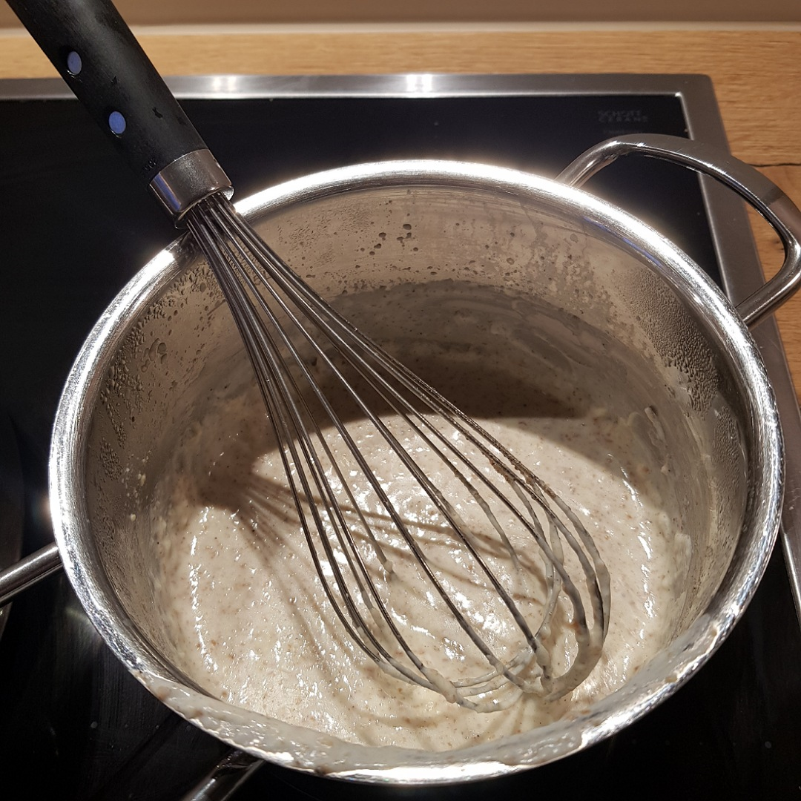

# Bechamel Sauce

## Zutaten
- 40 g Butter
- 40 g Mehl
- 400 ml Milch

## Außerdem
- Salz
- Pfeffer
- Muskatnuss

## Rezept
- Mehlschwitze in einem Topf anbraten
  - Butter zergehen lassen
  - Mehl einrühren und goldig braten

- Milch aufgießen und unter rühren einkochen lassen

- Mit reichlich Salz, Pfeffer und etwas Muskatnuss würzen

*Guten Appetit*
