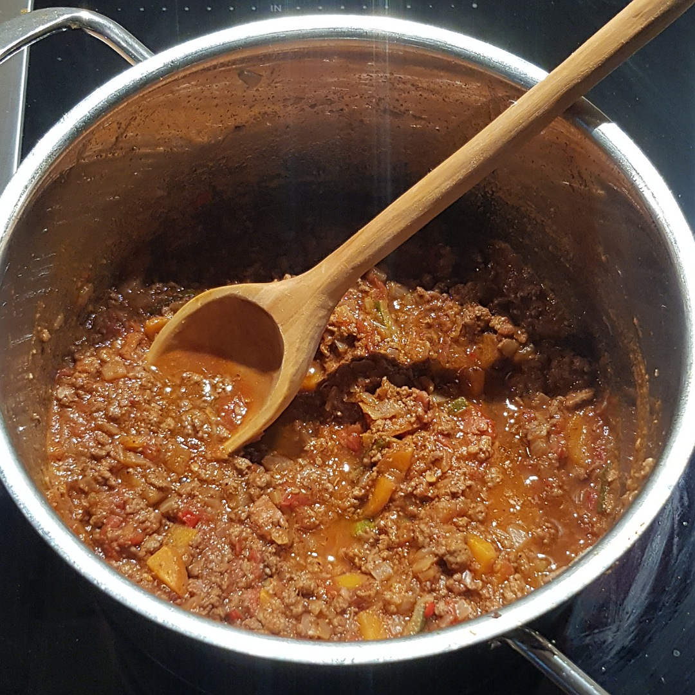

# Bolognese Sauce

Für 3-4 Portionen

## Zutaten
- 250 g Rinderhack
- 20 g Speck
- 1 Dose gehackte Tomaten
- 1 große Zwiebel
- 1 Knoblauchzehe
- 1 Möhre
- 1/4 Zucchini
- 1-2 Lorbeerblätter
- 2 Stangen Basilikum / 10 Basilikumblätter
- 1-2 cm Chili
- 250 ml Rotwein
- 50 ml Rotweinessig

## Rezept
- Zwiebel und Knoblauch fein würfeln

- Möhre, Zucchini und Speck grob würfeln

- Zwiebel und Knoblauch scharf im Topf mit 2-3 Esslöffel Olivenöl glasig braten

- Möhre, Zucchini und Speck zum Topf hinzugeben und 1-2 Minuten weiter scharf anbraten

- Hackfleisch in den Topf geben und unter rühren 2-3 Minuten braten

- Mit Rotwein ablöschen

- Chili schneiden

- Folgendes hinzugeben:
  - Tomaten
  - Rotweinessig
  - Lorbeerblätter
  - Chili
  - 2 Teelöffel Zucker
  - 2 Teelöffel Salz
  - Paprikapulver
  - Pfeffer
 
- Mit Topfdeckel >1 Stunde köcheln lassen

- Lorbeerblätter herausfischen

- Basilikum klein schneiden und hineingeben

- Je nach Bedarf (einen Esslöffel) Tomatenmark unterrühren

*Guten Appetit*
