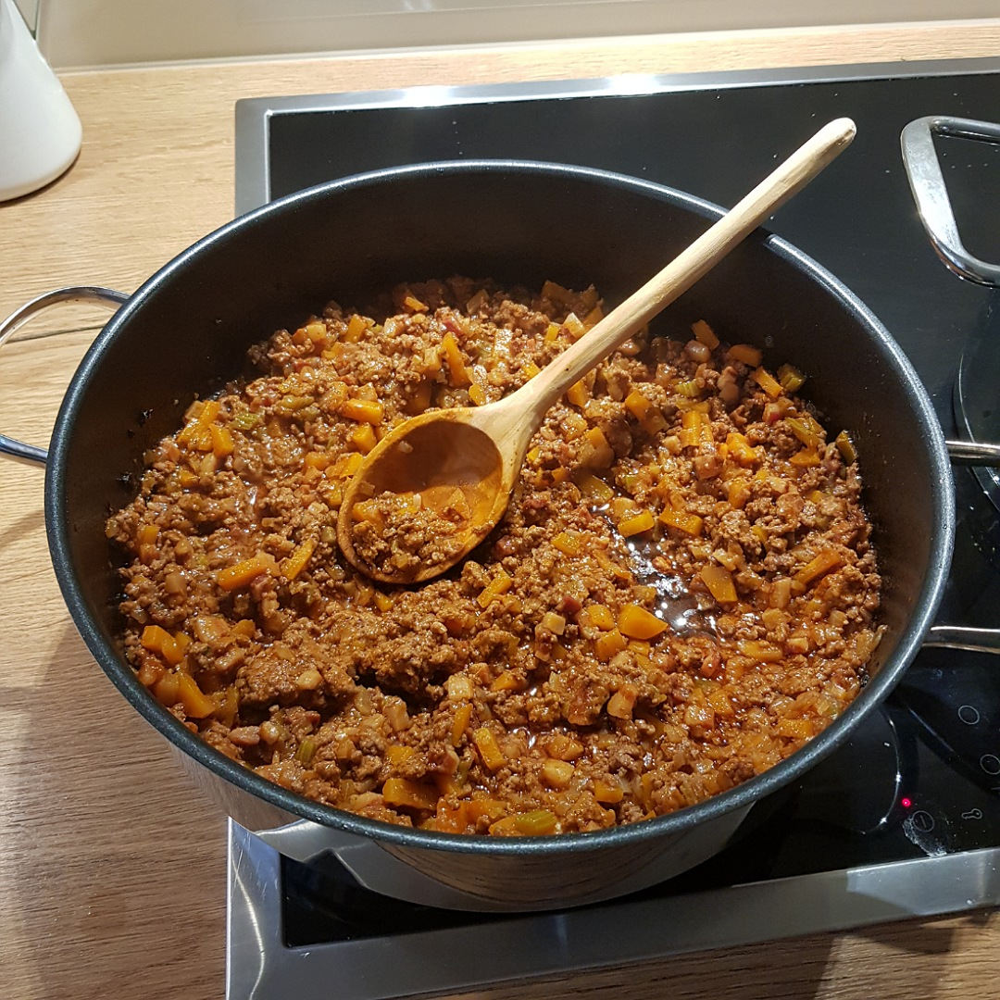

# Bolognese Sauce

Für 3-4 Portionen

## Zutaten
- 500 g Rinderhack oder HalbHalb
- 100 g Pancetta
- 1 große Zwiebel
- 1 Möhre
- 1-2 Stangen Staudensellerie
- 100 ml Rotwein
- 500 ml Brühe

### Außerdem
- Olivenöl
- Butter
- Tomatenmark

## Rezept
- Panchetta klein würfeln

- Zwiebel, Möhre und Sellerie klein würfeln

- In einer Pfanne (mit vorhandenem Deckel) 3 Esslöffel Olivenöl mit 3 Esslöffel Butter erhitzen

- Pancetta in der Pfanne für 1-2 Minuten braten

- Zwiebel, Möhre und Sellerie hinzurühren und braten, bis die Zwiebeln glasig werden

- Hackfleisch in der Pfanne auf hoher Hitze scharf braten, bis kein Fleischwasser mehr austritt
  - Je nach Kochplatte, ggf. vorher Gemüse herausnehmen oder/und in mehreren Portionen anbraten

- Rotwein aufgießen

- 3 gehäufte Esslöffel Tomatenmark verrühren

- So viel Brühe zur Pfanne geben, bis alles leicht bedeckt ist und durchrühren

- Entweder im Backofen oder bei kleiner Stufe mit Topfdeckel 1-2 Stunden köcheln lassen, gelegentlich umrühren und bei Bedarf, Brühe nachgießen.

*Guten Appetit*
