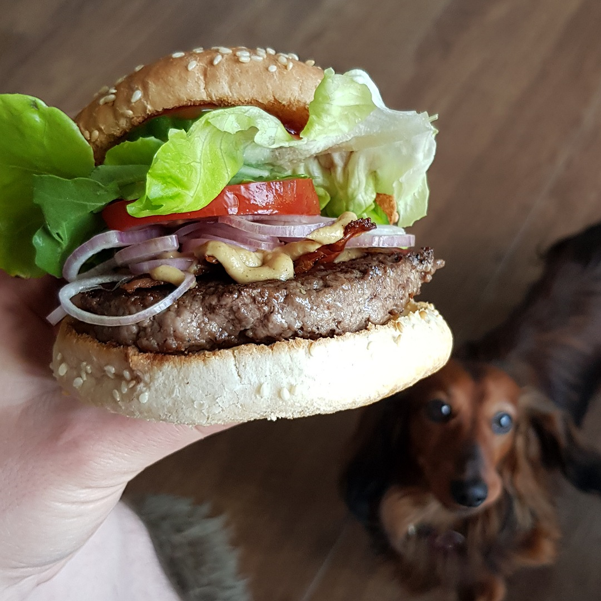

# Burger

Für einen Burger:

## Zutaten
- Burgerbrötchen
- 125 g gutes Rinderhack
- Scheibenkäse oder Reibkäse
- Tomatenscheibe
- 4 Gurkenscheiben
- Salatblatt
- Zwiebelringe
- optional Speckstreifen

## Rezept
- Rinderhack mit Burgerpresse oder von Hand zu einem Patty pressen

- Patty großzügig mit Salz und Pfeffer würzen

- Patty mindestens 30 Minuten in den Kühlschrank stellen

- Käse auf die untere Burgerbrötchenhälfte legen

- Brötchen in den Backofen auf Grillstufe legen, bis der Käse geschmolzen ist

- Patty in der Mitte mit einem Esslöffel andrücken (Um ein aufblähen zu vermeiden)

- Patty mit Öl von beiden Seiten scharf anbraten

- Optional am Ende den Speckstreifen von beiden Seiten braten und anschließend mit Küchenpapier trocknen

- Belegen der unteren Brötchenhälfte:
  - Patty
  - (Speck)
  - Senf
  - Zwiebelringe
  - Tomatenscheibe

- Belegen der oberen Brötchenhälfte:
  - Ketchup und Mayo
  - Gurkenscheiben
  - Salatblatt

## Tipp
Das Patty zusätzlich mit Zimt würzen, für eine interesannte deftige Note

*Guten Appetit*
