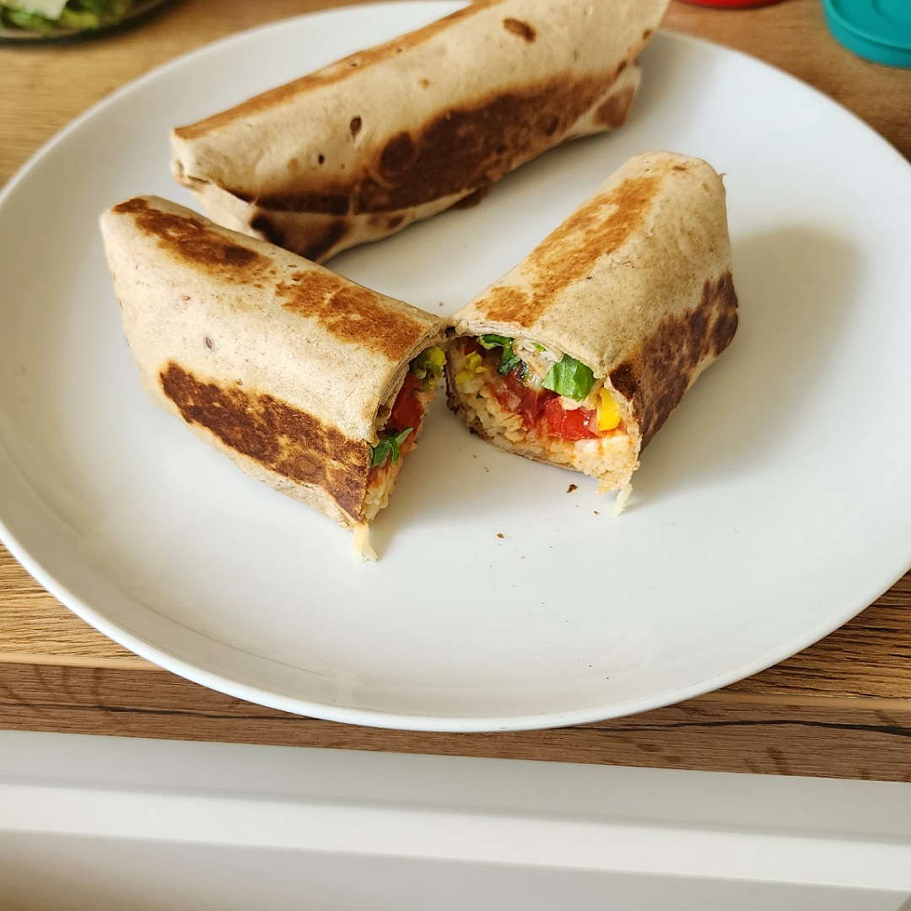

# Burritos

Für 4 Burritos:

## Zutaten
- [Reis](Reis.md)
- [Hähnchenbrust](Haehnchenbrust.md), z. B. gebacken
- 2 Tomaten
- 6 cm Salatgurke
- 1/2 Paprika
- Zwiebel
- 4 große Tortillas (Wraps)
- Romanasalat
- Reibkäse
- Soßen (einzeln oder kombiniert)
  - [Chili Sauce](Chili_Sauce.md) 
  - [Guacamole](Guacamole.md)
  - Cremé Fraiche

### Außerdem
- Olivenöl
- Salz
- Pfeffer
- Zitronensaft

## Rezept
- Tomate entkernen und in Würfel schneiden
  - Tomatenkerne für den [Reis](Reis.md) verwenden

- Salatgurke, Paprika und Zwiebel würfeln und zusammen mit den Tomatenstücken in eine Schüssel geben

- Schüsselinhalt würzen mit:
  - 1 Esslöffel Olivenöl
  - Salz
  - Pfeffer
  - Etwas Zitronensaft

- [Hähnchenbrust](Haehnchenbrust.md) in Stücke schneiden

- Romanasalat schneiden und waschen

### Burrito zubereiten
- In die Mitte der Tortilla 2 Esslöffel Reis legen
- Darauf ein paar Hähnchenstücke und darauf etwas Reibkäse
- Tortilla kurz in der Mikrowelle erwärmen (50 Sekunden)
- Belegen mit:
  - Soße (einzeln oder kombiniert):
    - [Chili Sauce](Chili_Sauce.md) 
    - [Guacamole](Guacamole.md)
    - Cremé Fraiche
  - 2 Esslöffel von der Gemüsesalsa
  - Romanasalat
- Zuerst den Tortilla links und rechts ein wenig zur Mitte falten
- Anschließend von unten nach oben zu rollen
- Mit der Teigüberlappung nach unten in einer erhitzten Pfanne ohne Öl kurz von ein paar Seiten anbacken
- In Aluminiumfolie einwickeln und servieren

## Tipp
- Soßen um etwas frische [Guacamole](Guacamole.md) ergänzen

*Guten Appetit*
