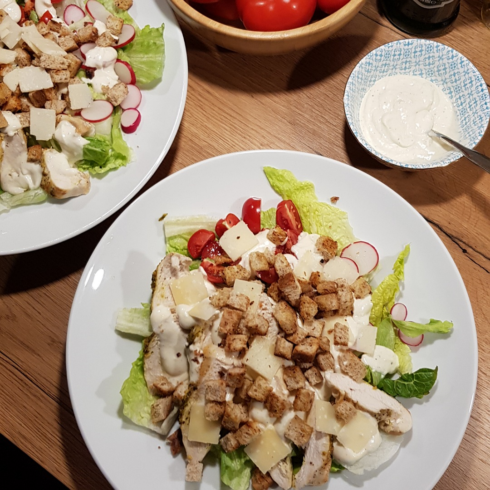

# Caeser Salad

Für eine Portion:

## Zutaten
- 1x [Gebackene Hähnchenbrust](Gebackene_Haehnchenbrust.md)
- [Caeser Sauce](Caeser_Sauce.md)
- Romana Salat
- Eisberg Salat
- 1 Scheibe Toast
- 3 Kirschtomaten
- 2 Radieschen
- 20 g Parmesan

## Rezept
- Toast klein würfeln und in Butter oder Olivenöl braten

- Parmesan in flache Scheiben schneiden

- Salat in Streifen scheiden

- Kirschtomaten und Radieschen schneiden

- Auf dem Teller servieren

*Guten Appetit*
