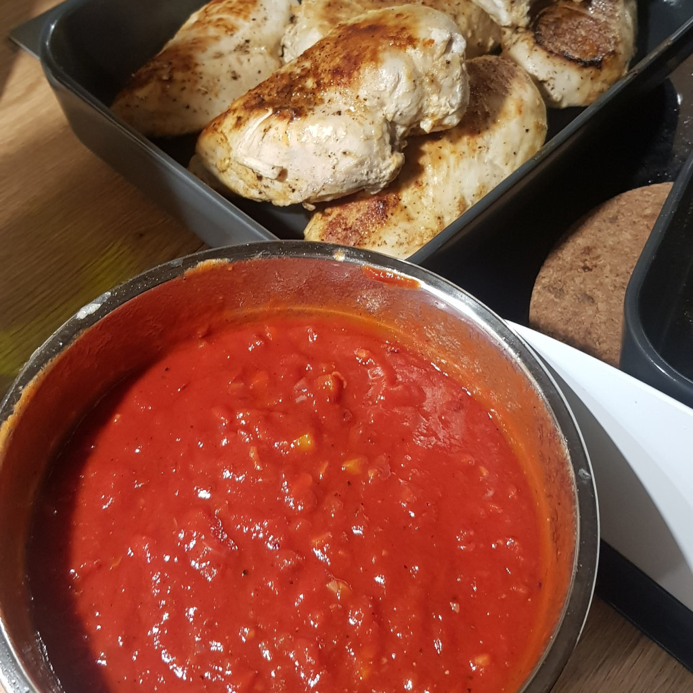

# Chili Soße

## Zutaten
- 1/4 Paprika
- 1/2 rote Zwiebel
- 1 Knoblauchzehe
- 2-3 cm Chili (optional)
- Hähnchensud von Backen
- ca. 1/2 Tube Tomatenmark

## Außerdem
- Olivenöl
- Honig
- Zitronensaft
- Salz
- Pfeffer

## Rezept
- Paprika, Zwiebel, Knoblauchzehe und Chili (optional) fein würfeln

- In einer Pfanne mit reichlich Olivenöl glasig braten (Pfanne vom Hähnchen)

- Pfanneninhalt in eine Schüssel geben und würzen mit:
  - Esslöffel Honig
  - Zitronensaft
  - Salz
  - Pfeffer
  - Hähnchensud vom Backhähnchen

- So lange Tomatenmark einrühren, bis die gewünschte Konsistenz erreicht ist

*Guten Appetit*
