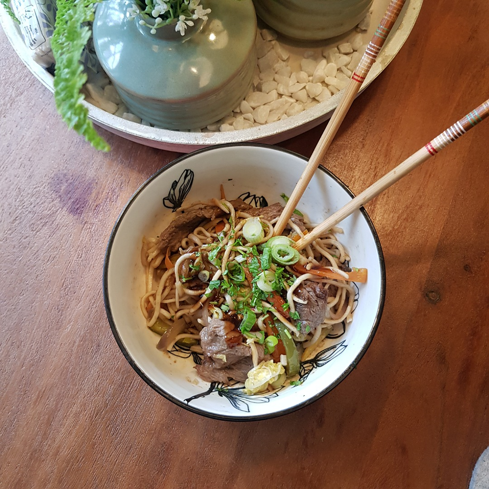

# Chow Mein

*Für 4 Portionen*

##Zutaten
- 250 g Mie-Nudeln (ohne Ei)
- 2 Hähnchenbrüste oder Rindfleisch
- 1/2 China-Kohl
- 4 Möhren
- 2 Zwiebeln
- 1 Knoblauchzehe
- 2 cm Ingwer
- 2 Stangen Staudensellerie
- 1 Paprika
- 100 g Mungo-Bohnen-Sprossen
- 2 Frühlingszwiebeln
- ca. 10 Petersilienstangen

##Außerdem
- Sesamöl
- Helle Soja Sauce
- Dunkle Soja Sauce
- Austernsoße
- Speisestärke

##Rezept
- Fleisch in feine Streifen schneiden, je nach Dicke halbieren

- Fleisch von Hand marinien mit:
  - 1 gehäufter Esslöffel Speisestärke
  - 2 Esslöffel Sesamöl
  - 1 Esslöffel Helle Soja Sauce
  - Ein paar Spritzer (2 Teelöffel) Austernsauce

- Möhren, Zwiebeln, Paprika, Staudensellerie in gleich lange dünne Streifen schneiden
  - getrennt zur Seite stellen

- Knoblauch und Ingwer in fein hacken

- Chinakohl in 1 cm breie Streifen schneiden

- Mungobohnen waschen und abtropfen

- Frühlingszwiebeln in Ringe schneiden und Petersilie hacken, und für das Topping später zur Seite stellen

- Im erhitzten Wok nach und nach das Gemüse braten
  - Mit Sesamöl oder Kokosfett

- Währenddessen die Mie-Nudeln nach Packungsvorschlag zubereiten

- Gemüse aus dem Wok nehmen und nach und nach dad Fleisch braten

- Ingwer-Knoblauch in den Wok geben
  
- Restliches Gemüse in den Wok geben

- Jetzt auch die Mie-Nudeln in den Wok und alles gut durchheben.
  - Am besten mit Pfannenwender in der einen Hand und Stäbchen in der anderen.

- Servieren mit Topping:
  - Etwas Sesamöl
  - Etwas dunkle Soja Sauce
  - Etwas Austern Sauce
  - Und etwas von der Frühlingszwiebel-Petersilie

*Guten Appetit*
