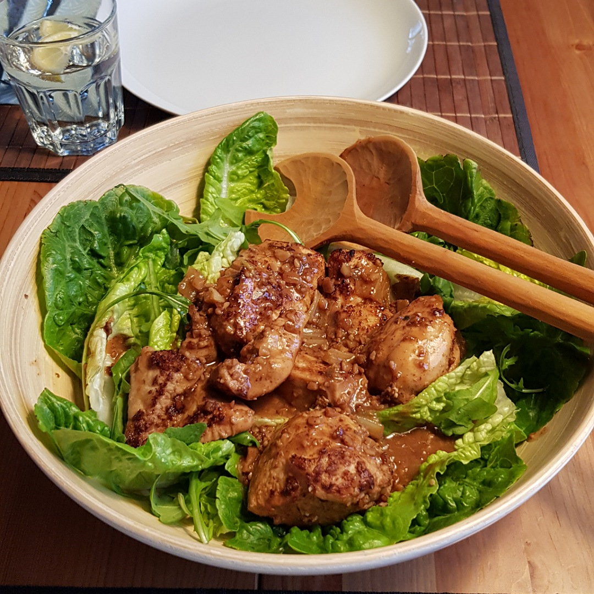

#Erdnusshähnchen auf Salatbett

Für 3-4 Portionen:

## Zutaten
- 2 Hähnchenbrüste
- Eine Hand voll Erdnüsse
- 1 Salatherz
- Ein wenig Rucula
- 1 Koblauchzehe

## Rezept
- Erdnüsse klein mörsern

- Erdnusspaste mit Ingwer, Muskatnuss, Zimt, 2 Esslöffel Sojasoße und ein paar Spritzer Austernsoße würzen

- Mit 1 Esslöffel Butter und 2-3 Esslöffel Rapsöl verrühren

- Hähnchenbrüste in je drei Teile schneiden, mit der Erdnusscremé marinieren und 30 Minuten ziehen lassen

- In einer Schmorpfanne (große Pfanne mit Deckel) Butter vorsichtig zergehen lassen 

- Die Knoblauchzehe mit einem Messer pressen und zur Butter geben

- Die Hähnchenbrüste von beiden Seiten je 2 Minuten braten

- 150 ml Hühnerbrühe in die Pfanne geben und 15-20 Minuten auf mittlerer Hitze mit dem Deckel schmoren lassen

- In der Zwischenzeit das Salatherz und den Rucula waschen. Die Reste vom Salatherz mit in der Pfanne schmoren lassen

- Nach dem schmoren den Knoblauch und grobe Reststücke des Salatherzes aus der Pfanne fischen

- Mit Speisestärke andicken und zusammen auf dem Salat servieren

*Guten Appetit*
