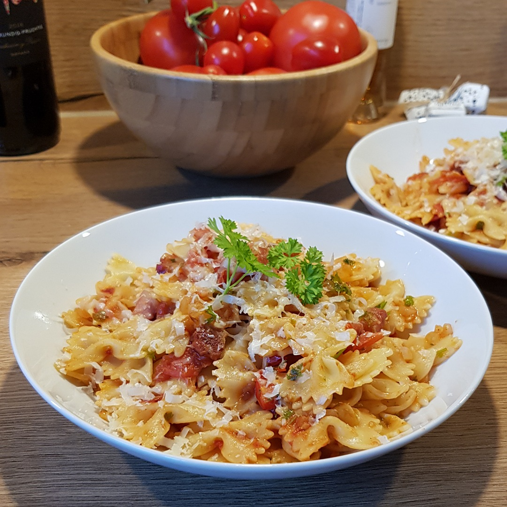

# Farfalle all’amatriciana

Für eine Portion:

## Zutaten
- 100 g Farfalle
- 50 g Pancetta
- 1 Zwiebel
- 1 Knoblauchzehe
- 6 Kirschtomaten
- 12 Stangen Petersilie (ergibt ca. einen gehackten Esslöffel)

### Außerdem
- Olivenöl
- Weißwein
- Tomatenmark
- Salz
- Pfeffer
- Parmesankäse

## Rezept
- Pancetta würfeln

- Farfalle kochen (80% - 90% der Kochzeit)

- Pancetta in einer großen Pfanne mit keinem oder ein wenig Olivenöl braten
  - Wenn der Pancetta genug Fett hat braucht man kein Öl

- Knoblauchzehe mit dem Messer eindrücken und zur Pfanne geben

- Zwiebel würfeln und nach ein paar Minuten in die Pfanne hinzugeben

- Wenn die Zwiebeln glasig sind Knoblauchzehe herausfischen

- Mit einem Schuss Weißwein ablöschen

- Kirschtomaten halbieren und hinzugeben

- Farfalle direkt aus dem Topf in die Pfanne geben und das Nudelsalzwasser aufbewahren

- Ein wenig Nudelsalzwasser und ca. 1 Esslöffel Tomatenmark in die Pfanne geben und durchrühren

- Petersilie fein würfeln und in die Pfanne geben

- Mit Salz und Pfeffer auf dem Teller würzen und mit Parmesan servieren

## Tipp
Für ein entspannteres kochen kann man natürlich auch vorab alles fertig vorbereiten/schneiden

*Guten Appetit*
