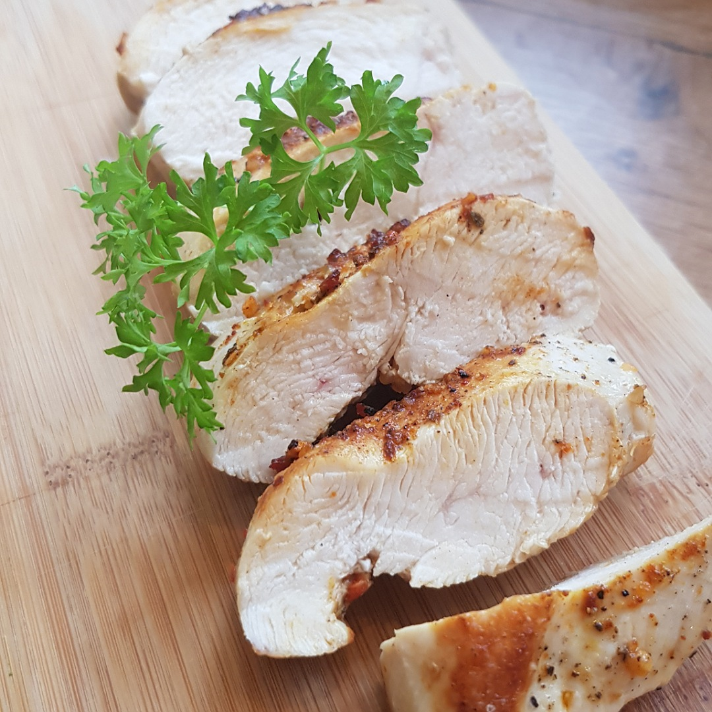

# Gebackene Hähnchenbrust

## Rezept
- Optional: Gemüsereste falls vorhanden in eine Auflaufform geben und mit einem Schuss Weißwein bedecken (Reste/Rand von Zwiebeln, Paprika, Zucchini, Salat, ...)

- Auflaufform in den Ofen stellen und auf 160°C erhitzen

- Hähnchenbrust in einer heißen Pfanne mit 1-2 Esslöffel Raps- oder Olivenöl scharf anbraten

- Nach 1-2 Minuten wenden und die obere Seite würzen (Salz, Pfeffer, ...)

- Nach weiteren 1-2 Minuten die Hähnchenbrust gewendet in die Auflaufform stellen und die andere Seite würzen

- Für ca. 20 Minuten backen (10 min/cm Dicke), falls vorhanden: Mit Fleischthermometer 72°C Kerntemperatur abwarten

## Tipp
Alternativ kann man auch eine Salzkruste erzeugen, indem man die Hähnchenbrust +30 Minuten vorher mit Salz würzt

[Weitere Zubereitungsarten für Hähnenbrüste](Haehnchenbrust.md)

*Guten Appetit*
