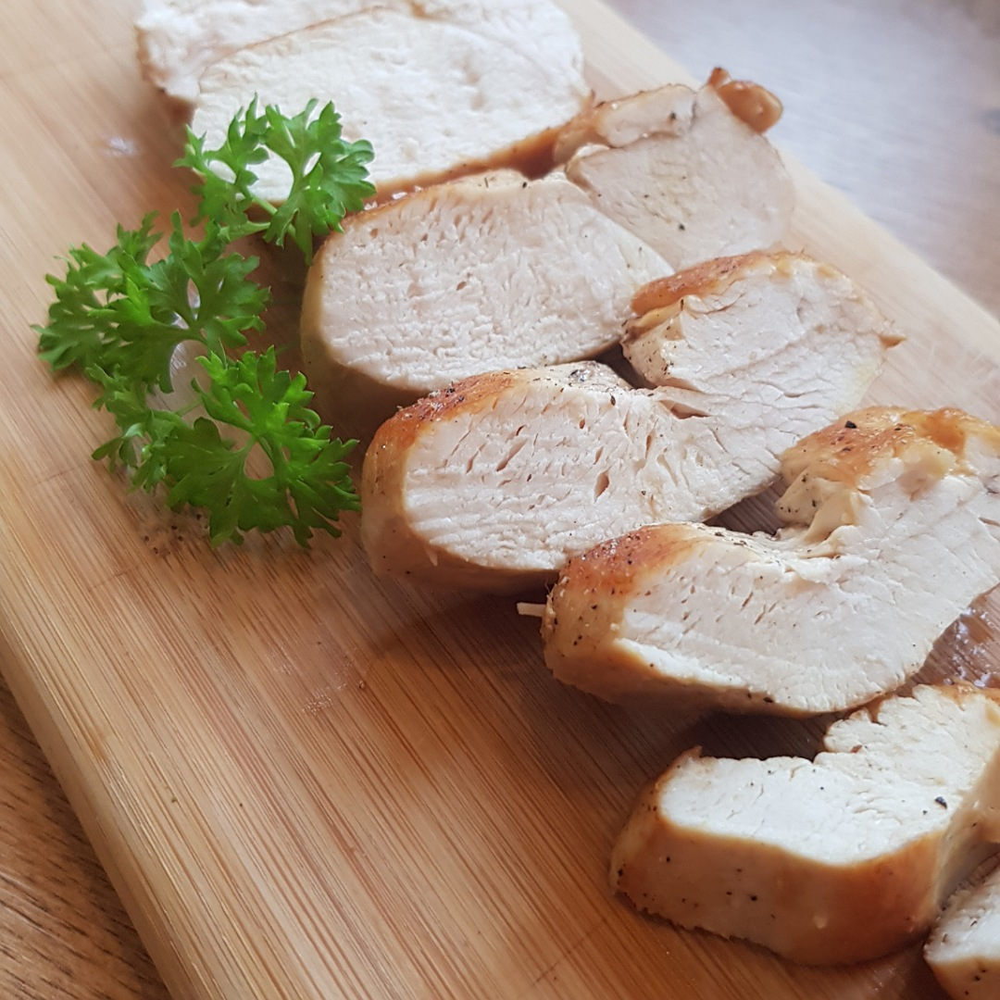

# Gebratene Hähnchenbrust

## Rezept
- 1-2 Esslöffel Rapsöl in einer Pfanne auf hoher Stufe erhitzen

- Hähnchenbrust von beiden Seiten scharf je 1-2 Minuten anbraten

- Pfanne auf 2/3 Hitze stellen

- Jede Minute die Hähnenbrust wenden, ca. 6-8 Minuten lang

- Aus der Pfanne nehmen und würzen (Salz, Pfeffer, ...)

[Weitere Zubereitungsarten für Hähnenbrüste](Haehnchenbrust.md)

*Guten Appetit*
