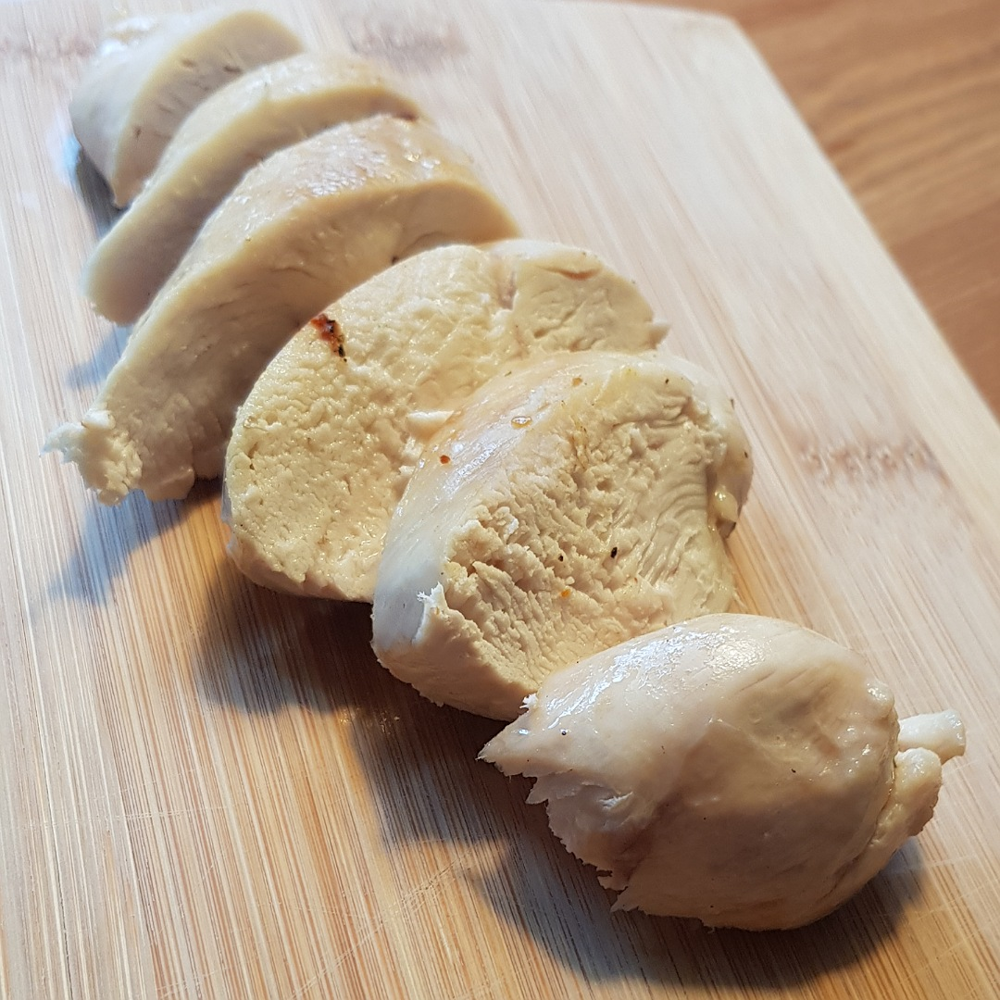

# Gedämpfte Hähnchenbrust

## Rezept
- Hähnchenbrust marinieren und mindestens 30 Minuten einziehen lassen

- Hähnchenbrust 15 Minuten in Brühe der Wein dämpfen

- Hähnchenbrust kurz scharf von beiden Seiten anbraten, um eine Kruste zu erzeugen

### Tipp
Mit Salr marinieren für eine Salzkruste

*Guten Appetit*
