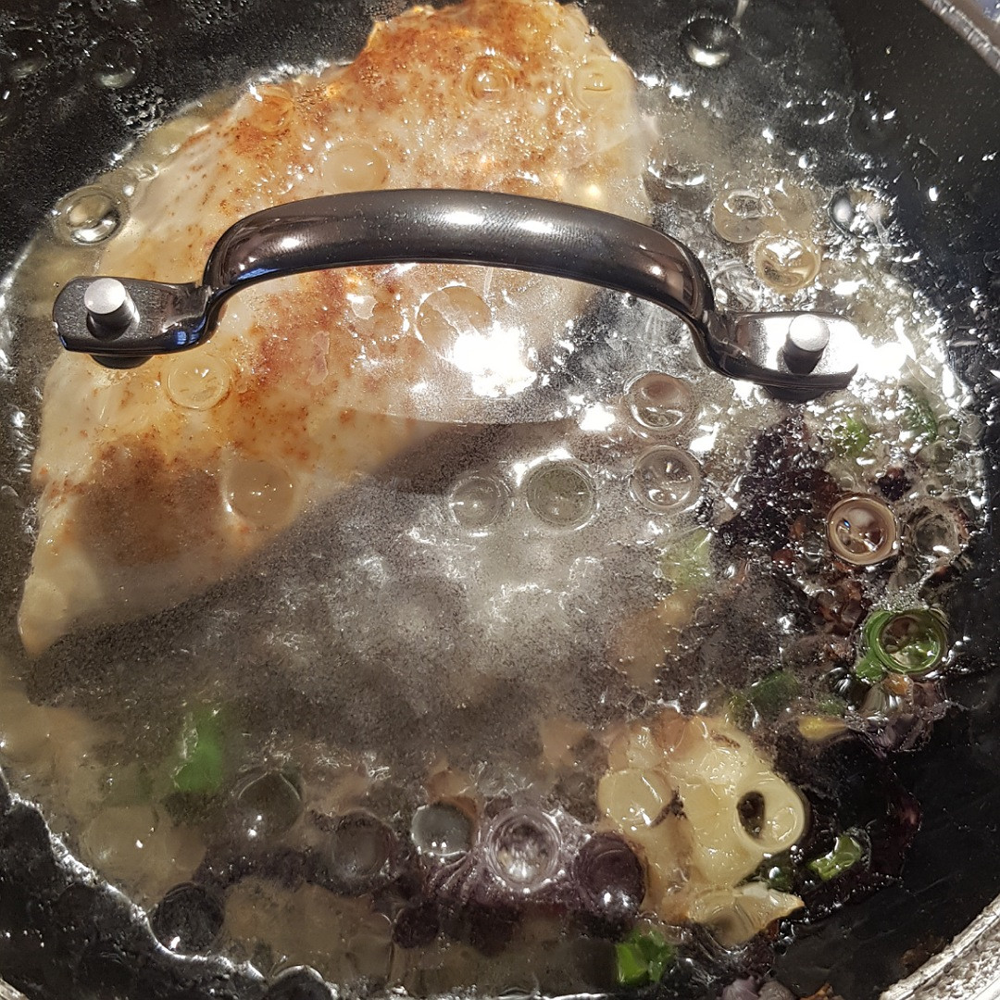

# Gedünstete Hähnchenbrust

## Rezept
- Hähnchenbrust in einer heißen Pfanne mit 1-2 Esslöffel Raps- oder Olivenöl 1-2 Minuten scharf anbraten

- Wenden und die andere Seite 2 Minuten scharf anbraten

- Pfanne auf halbe Hitze stellen und erneut wenden

- Falls vorhanden Gemüsereste zur Pfanne geben und mit einem Schuss Weißwein bedecken (Reste/Rand von Zwiebel, Paprika, Zucchini, ...)

- Mit aufgelegtem Topfdeckel ca. 10 Minuten dünsten lassen

- Herausnehmen und würzen (Salz, Pfeffer, ...)

[Weitere Zubereitungsarten für Hähnenbrüste](Haehnchenbrust.md)

*Guten Appetit*
