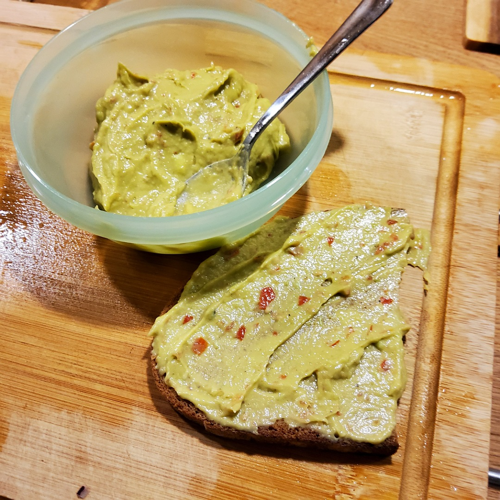

# Guacamole

## Zutaten
- Avocado
- 2 Kirschtomaten

## Außerdem
- Salz
- Zitronensaft

## Rezept
- Avocado halbieren und den Kern entfernen
- Schale abtrennen und die Avocado in groben Stücken in den Mixer geben
- Kirschtomaten halbieren und auch in den Mixer geben
- Mit Salz und Zitronensaft abschmecken

## Tipp
- Eine reife Avocado ist nicht mehr hart von außen, aber noch nicht braun von innen.

*Guten Appetit*
