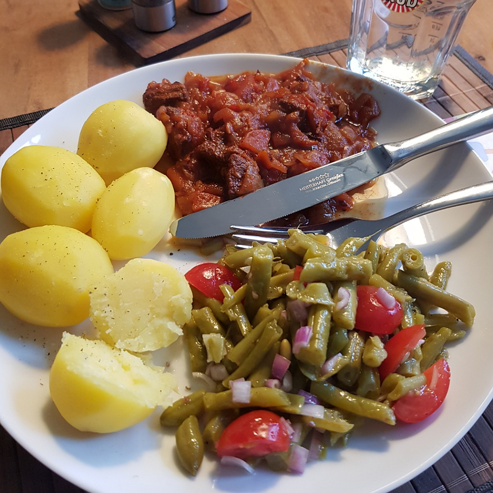

# Gulasch

Für 3-4 Portionen

## Zutaten
- 500 g Rindergulasch
- 40 g Speck
- 4-6 Zwiebeln
- 1-2 Knoblauchzehen
- 1 Paprika
- 1 Möhre
- 50 g Sellerie
- 3 Chilis (z. B. Rawit) (Optional)
- 250 ml Rotwein
- 500 ml Brühe (z. B. Rinderbrühe)

### Außerdem
- Rapsöl
- Salz
- Paprikapulver
- Tomatenmark
- Pfefferkörner
- Loorbeerblatt
- Weitere optionale Gewürze:
  - Wacholder
  - Rosmarin
  - Thymian

## Rezept
- Knoblauchzehen, Sellerie und Chilis (optional) fein würfeln

- Speck, Zwiebeln, Paprika und Möhre grob würfeln

- Rindergulasch in einer Schmorpfanne mit Rapsöl anbraten

- Rindergulasch aus der Pfanne holen

- Paprika in der Pfanne ein paar Minuten braten

- Nach und nach Möhren, dann Zwiebeln, dann Speck und dann den Rest zur Pfanne geben (inklusive des Rindergulasch).

- Inhalt salzen und ein wenig weiter braten

- Mit Rotwein und der Brühe ablöschen

- 2 Teelöffel Paprikapulver und 3 Esslöffel Tomatenmark einrühren

- Kräuter und Gewürze in einem Teebeutel zum Gulasch geben
  - z. B.:
    - Pfefferkörner
    - Wacholder
    - Loorbeerblatt
    - Rosmarin
    - Thymian

- Mit Deckel in einem vorgeheiztem Ofen (Umluft 180° C) mehrere Stunden (2-3) köcheln lassen und gelegentlich umrühren
  - Alternativ auf der Kochplatte und dabei öfter umrühren

*Guten Appetit*
