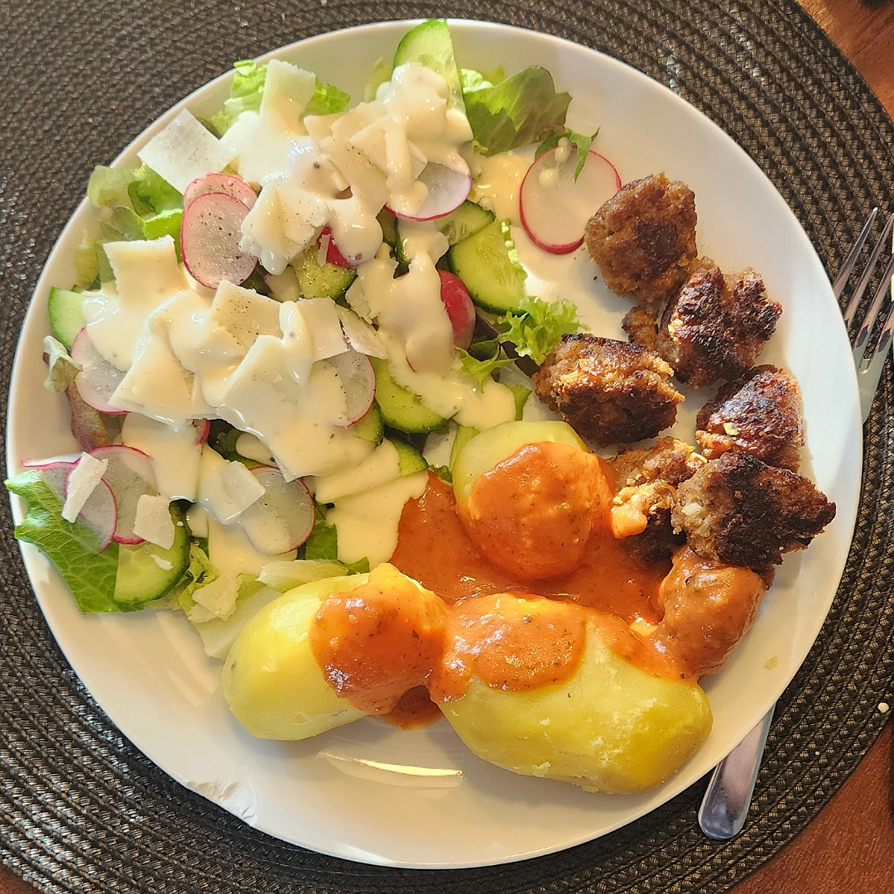

# Hackbällchen

Für einen 2-3 Portionen:

## Zutaten
Hackbälchen
- 250 g Rinderhack
- 1 Knoblauchzehe
- 1-2 Zwiebeln
- 2 Eier
- 100 g Mehl

## Zutaten Tomatensoße
- Dose gehackte Tomaten
- Schalotte
- Balsikikum

### Außerdem
- Salz
- Pfeffer
- Olivenöl
- Weißwein

## Rezept
Hackbällchen

- Zwiebeln fein würfeln

- Rinderhack, Zwiebeln, Eier, Mehl, Salz und Pfeffer in einer Schüssel mit den Händen durch kneten

- Hackmischung 10 Minuten ruhen lassen

- Koblauchzehe pressen und in 3 Esslöffel Olivenöl anschwitzen

- Kleine Kugeln formen und bei gelegentlichem wenden braten

## Rezept Tomatensoße
- Schalotte fein würfeln

- In einem Topf mit Olivenöl glasig braten

- Hitze reduzieren und dann die Dose gehackte Tomaten dazuschütten

- Die Dose mit einem Schuss Weißwein auswaschen und zur Soße geben

- Etwas köcheln und reduzieren lassen

- Hitze abstellen und gehacktes Basilikum unterrühren

## Tipp
Schmeckt super als Beilage mit Kartoffeln und Salat

*Guten Appetit*
