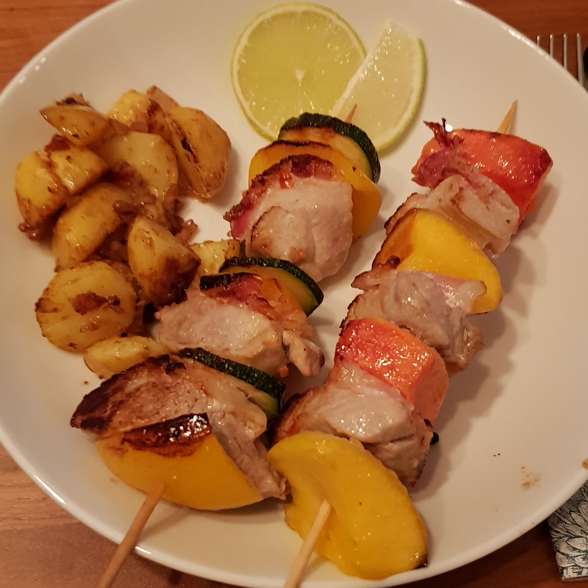

# Karibische Spieße

Für 6 Spieße:

## Zutaten
- 600 g Schweinefilet
- 75 g Speckstreifen
- 75 ml Erdnussöl
- 10 Minzblätter
- 1/2 Limette
- 1 cm Chili
- 2 Knoblauchzehen
- 1 Mango
- 1 Papaya
- 6 cm Zuchhini
- 1/2 Paprika

## Rezept
- Knoblauch und Chili klein würfeln und mit Erdnussöl und Minzblätter vermengen

- Den Saft der Limette zur Marinade geben

- Schweinefilet in Stücke schneiden, mit der Marinade begießen und >30 Minuten ziehen lassen

- Mango, Papaya und Paprika in Stücke schneiden (2 x 2 cm), Zucchini in 2 mm Dicke scheiben schneiden

- Speckstreifen in Stücke schneiden (2 x 2 cm)

- Auf die 6 Spieße immer abwechselnd Fleisch, Speck und Früchte/Gemüse stecken

- Spieße in einer Pfanne mit etwas Öl wendent ca. 6 Minuten braten

*Guten Appetit*
