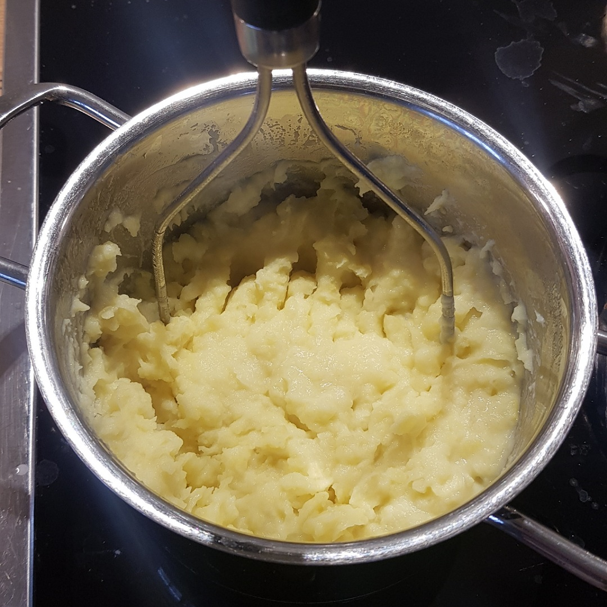

# Kartoffelpüree

## Zutaten
- 500 g Kartoffeln
- 150 ml Milch

## Rezept
- Kartoffeln schälen und würfeln

- 20 Minuten köcheln lassem

- abgießen und wieder in den Topf geben

- Milch eingießen und mit dem Kartoffelstampfer klein "pürieren"

*Guten Appetit*
