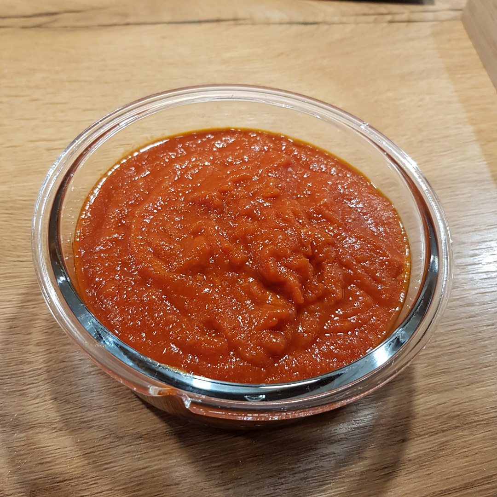

# Ketchup

## Zutaten
- Dose gehackte Tomaten
- 100 g Knollensellerie
- 1 Zwiebel
- 1 Knoblauchzehe
- 1/2 Zitrone

## Auderdem
- Honig
- Salz
- Olivenöl

## Rezept
- Knollensellerie, Zwiebel und Knoblauch in grobe Stücke schneiden

- Das geschnittene Gemüse in einem Topf mit 2 Esslöffel Olivenöl scharf anbraten, bis dir Zwiebeln glasig werden

- Hitze herabstellen und dann die Dose gehackte Tomaten dazurühren, mit etwas Rotwein die Dose auswaschen und dazu geben

- Saft der halben Zitrone, 2 Esslöffel Honig und 2 Teelöffel Salz unterrühren

- Alles +30 Minuten einköcheln und reduzieren lassen

- Mit dem Stabmixer pürieren und ggf. nachwürzen

**Guten Appetit**
