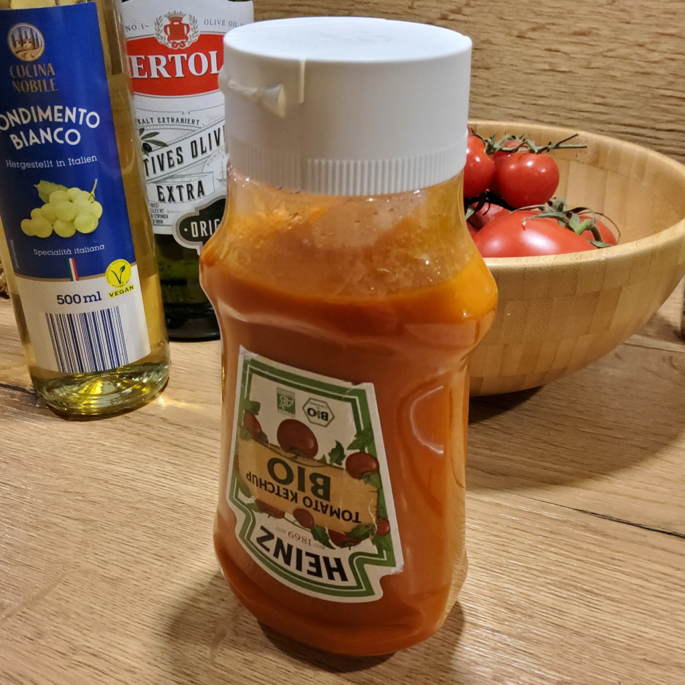

# Kinderketchup

## Zutaten
- Dose gehackte Tomaten
- Zwiebel
- Knoblauchzehe
- 10 cm Staudensellerie

## Außerdem
- Olivenöl
- Zitronensaft

## Rezept
- Zwiebel, Knoblauchzehe grob würfeln

- Sellerie in feine (1 mm) dicke Scheiben schneiden
  - Ansonsten bleiben Fasern nach dem pürieren in der Sauce übrig

- In einem Topf mit etwas Olivenöl das Gemüse glasig braten

- Hitze herabstellen und die Dose gehackte Tomaten einfüllen
  - Dosenreste mit beispielsweise etwas (alkoholfreiem) Weißwein in den Topf ausspülen
 
- Zitronensaft (1/3 - 1/2 Zitrone) zum Topf geben

- Mit angewinkeltem Topfdeckel +30 Minuten köcheln/reduzieren lassen, bis die gewünschte Konsistenz erreicht ist (schön dick, ist ja Ketchup...)

- Mit einem Stabmixer die Sauce fertig pürieren

## Tipp
Sauce nicht pürieren und direkt - stückig auf die Pasta geben.

Die Sauce ist absichtlich ungewürzt, man kann sie natürlich noch salzen und oder mit Honig verfeinern.

In einer verschlossenen Schüssel hält die Sauce bis zu vier Wochen im Kühlschrank.

*Guten Appetit*
