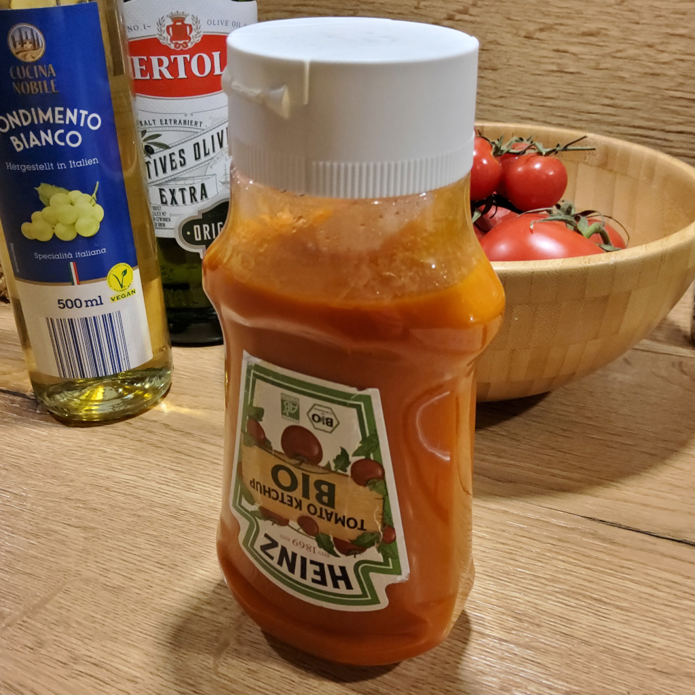

# Kinderketchup

## Zutaten
- Dose gehackte Tomaten
- Zwiebel
- Knoblauchzehe
- 10 cm Staudensellerie
- kleine Möhre

## Außerdem
- Olivenöl
- Weißweinessig oder frisch gepresster Zitronensaft
- alkoholfreier Weißwein

## Rezept
- Zwiebel, Knoblauchzehe, Möhre grob würfeln

- Sellerie in feine (1 mm) dicke Scheiben schneiden
  - Ansonsten bleiben Fasern nach dem pürieren in der Sauce übrig

- In einem Topf mit etwas Olivenöl das Gemüse glasig braten

- Topfinhalt mit einem Schuss alkohlfreiem Weißwein ablöschen und Tomaten hinzugeben
  - Dosenreste mit beispielsweise etwas alkoholfreiem Weißwein in den Topf ausspülen
 
- kleiner Schuss Weißweinessig oder frisch gepressten Zitronensaft einrühren

- Mit angewinkeltem Topfdeckel +30 Minuten köcheln/reduzieren lassen, bis die gewünschte Konsistenz erreicht ist (schön dick, ist ja Ketchup...)

- Mit einem Stabmixer die Sauce fertig pürieren

## Tipp
Sauce nicht pürieren und direkt - stückig auf die Pasta geben.

Die Sauce ist absichtlich ungewürzt, man kann sie natürlich noch salzen und oder mit Honig verfeinern.

In einer verschlossenen Schüssel hält die Sauce bis zu vier Wochen im Kühlschrank.

Bei der Sauce braucht man auch nicht geizen, ist ja nichts schlimmes drin und die (Kinder) könnten sie auch einfach so essen.

*Guten Appetit*
