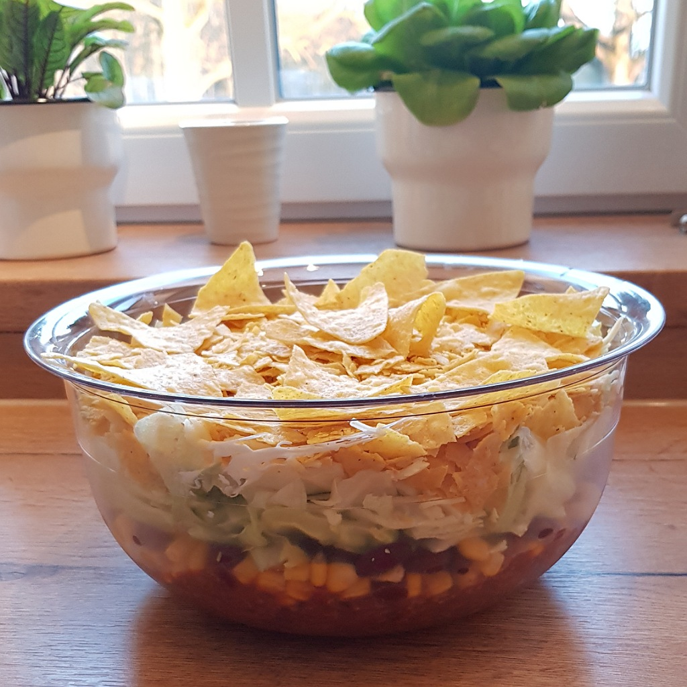
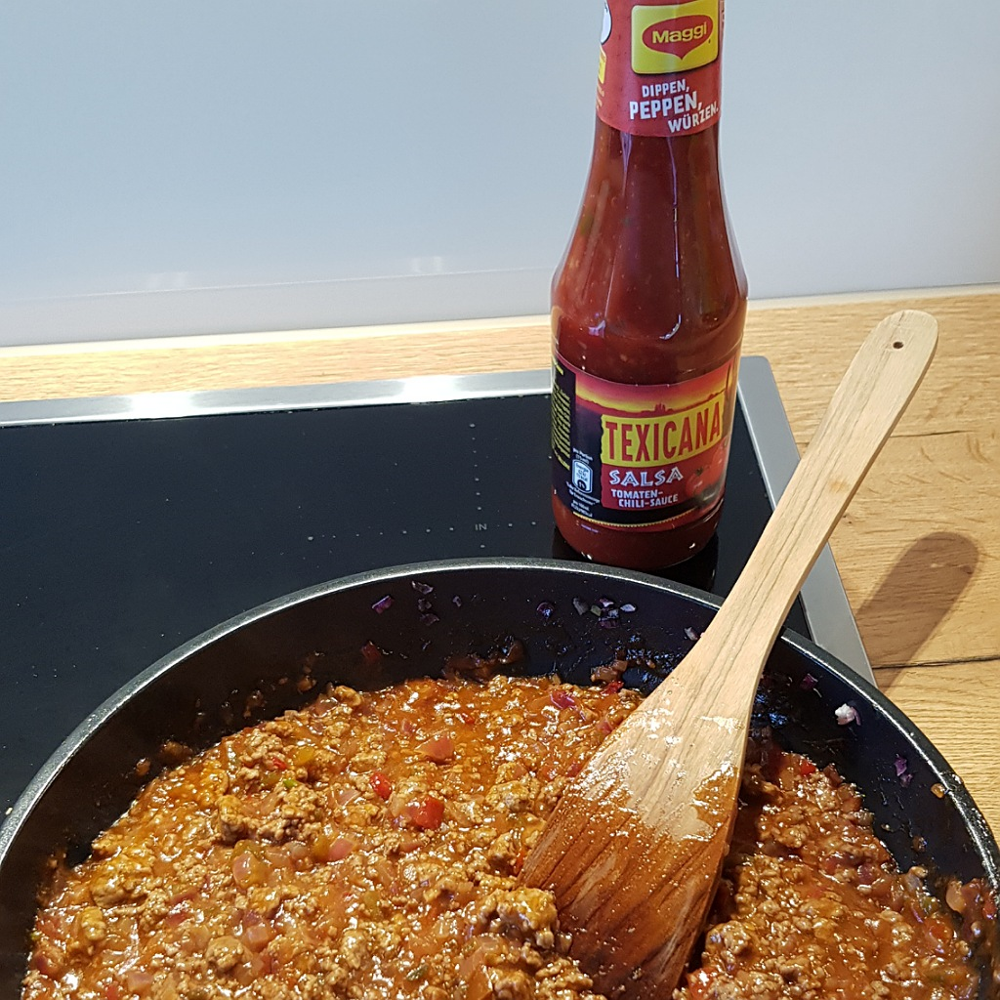

# Nachosalat

Für eine große Schüssel / Schale

## Zutaten
- 500 g Rinderhack
- 1 Flasche Maggi Texicana Salsa
- 2 große rote Zwiebeln
- 1 Limette
- 1/2 Eisbergsalat
- 250 g Kidneybohnen
- 250 g Mais
- 150 g Cremé Fraich
- 125 g Reibkäse
- 250 g Tortilla Chips / Nachos, z. B. gesalzen
- 4 kleine Chilis, z. B. Rawit oder eine große Peperoni, etc. (Optional)

### Außerdem
- Rapsöl

Maggi Texicana Salsa Sauce

## Rezept
- Die Zwiebeln und die Chilis (optional) klein würfeln

- In einer großen Pfanne die Zwiebeln und Chilis (optional) in Rapsöl glasig braten
  - je nach Kochplatte, eventuell in zwei Portionen braten, damit später das Hackfleisch nicht im austretenden Fleischwasser köchelt

- Das Rinderhack einrühren und solange braten, bis das Rinderhack durchgebraten ist

- Den kompletten Flascheninhalt der Salsa Sauce in die Pfanne schütten
  - Mit einem Schuss Wein die Reste der Flasche herausschütteln

- Saft der Limette ebenfalls zur Sauce geben und alles unter gelegentlichem rühren +10 Minuten köcheln lassen.

- Je nach Konsistenz der Hackfleischsauce weiter köcheln und anschließend abkühlen lassen

- Den Eisbergsalat würfeln und waschen

- Den Nachosalat in einer großen Schüssel / Schale schichten:
  - Hackfleischsauce
  - Vorher abgetropfte Kidneybohnen
  - Mais
  - Eisbergsalat
  - Cremé Fraich
  - Reibkäse

- Ein paar Tortilla Chips zur Deko beseite legen und die restlichen Chips in der Packung zerdrücken

- Die Chipskrümel als letzte Schicht auf den Salat legen und mit den beiseite gelegten Chips garnieren

## Tipp
Die Tortilla Chips erst kurz vor dem Anrichten schichten

*Guten Appetit*
