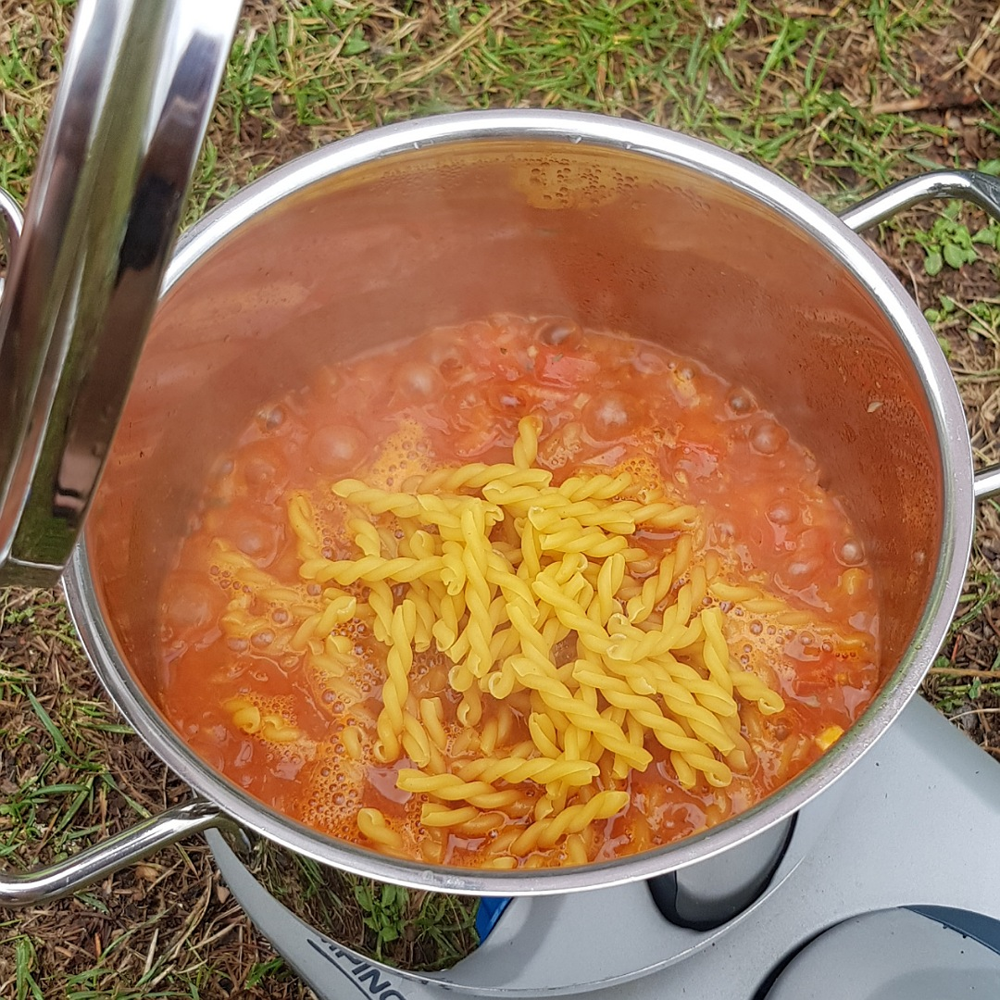

# One Pot Pasta

Für eine Portion:

## Zutaten
- 125 g Pasta (Kochzeit 7-12 Minuten, keine Spaghetti)
- 100 ml Tomatensauce oder gehackte Tomaten, etc.
- 1/2 Zwiebel
- 1 Knoblauchzehe

## Rezept
- Zwiebel grob und Knoblauchzehe fein würfeln

- Beides in 3 Esslöffel Olivenöl kurz scharf glasig braten (nicht anbrennen lassen)

- Tomatensauce und 250 ml warmes Wasser hinzugeben

- Mit Salz und Pfeffer würzen

- Die Pasta hinzugeben und unter rühren 100% - 125% der Kochzeit köcheln lassen

- Falls die Pasta noch nicht mit dem Tomatensud bedeckt ist, mehr Wasser hinzugeben

- Eventuell zwischendurch mehr Wasser hinzugeben. Besser vorher zu wenig als zu viel

## Tipp
Das Rezept ist eher eine Basis für One Pot Pasta, je nach Geschmack lässt sich viel variieren.
Z. B. Während der letzten 2 Minuten Kochzeit Basilikum / Oregano hinzugeben.
Oder Chili zur Zwiebel und dem Knoblauch.
...

*Guten Appetit*
