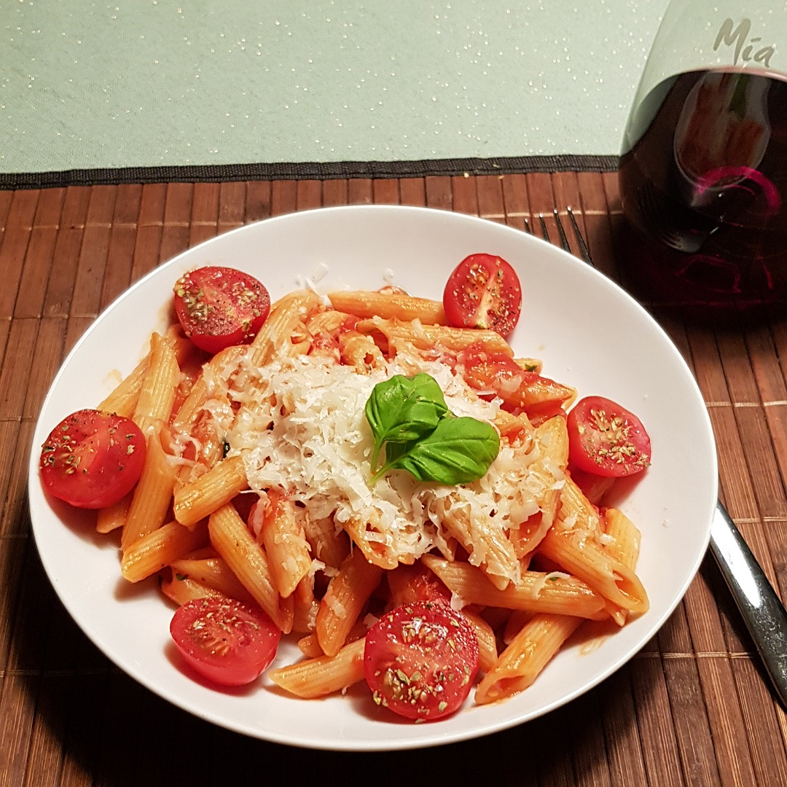

# Penne all Arrabbiata

Für eine Portion:

## Zutaten
- 125 g Penne
- 200 g geschälte Tomaten in der Dose
- 1 Knoblauchzehe
- 1 cm Chili
- 10 Blätter Petersilie

### Außerdem
- Olivenöl
- Salz

## Rezept
- Chili kleinschneiden (je nach schärfe Kerne entfernen)

- Knoblauchzehe mit dem Messer eindrücken

- Penne kochen (nicht abgießen, 90% der Kochzeit)

- Gleichzeitig zur Penne in einer großen Pfanne die Chili und Knoblauchzehe mit einem Esslöffel Olivenöl scharf anbraten

- Nach ca. 2 Minuten die Tomaten hinzugeben und bei mittlerer Hitze gelegentlich rühren und die Tomaten zerstoßen

- Bevor die Penne fertig ist, etwas Nudelsalzwasser zur Pfanne geben und die Knoblauchzehe herausfischen

- Petersilie kleinschneiden

- Die fertige Penne direkt aus dem Topf in die Pfanne geben

- Zusammen mit der Petersilie durchrühren und ca. 2 Minuten weiter braten

*Guten Appetit*
