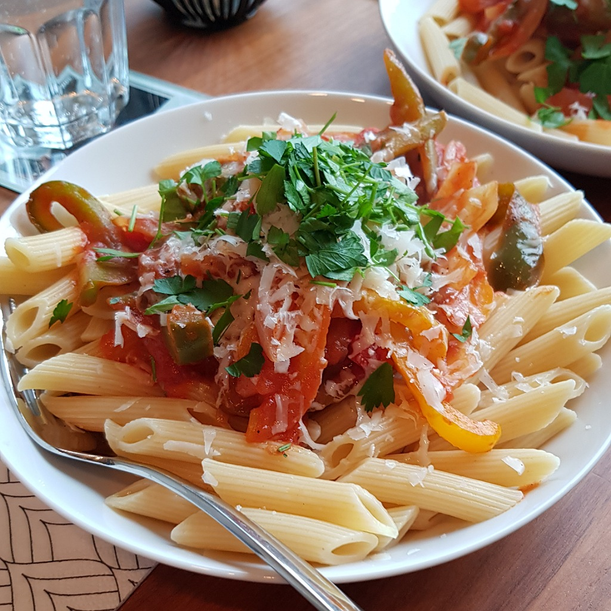

# Peperonata

Für 2-3 Portionen

## Zutaten
- 2 Paprika
- 3 Zwiebeln
- 1-2 Knoblauchzehen
- 1 Dose geschälte Tomaten (400 g)
- 50 ml Weißwein

## Rezept
- Paprika und Zwiebel grob würfeln oder länglich schneiden

- Knoblauchzehen eindrücken

- Paprika und Knoblauchzehe in 3 Esslöffel Olivenöl in einer Pfanne braten

- Zwiebel nach ein paar Minuten hinzugeben, eventuell mehr Olivenöl aufgießen und gelegentlich rühren

- Wenn die Zwiebeln glasig werden, salzen, Hitze herabstellen und ein paar Minuten rühren

- Knoblauchzehen herausfischen

- Vorsichtig die ganze Dose Tomaten einschütten

- Mit 50 ml Weißwein die Dose auswaschen und auch zur Pfanne geben

- Mit Salz und Pfeffer würzen und unter gelegentlichem Rühren köcheln lassen, bis die gewünschte Konsistenz erreicht ist
  - Tomaten mit dem Pfannenwender zerquetschen, sodass sie sich auflösen

## Tipp
Am Ende mit Oregano würzen.

Passt gut zu Penne Pasta.

*Guten Appetit*
