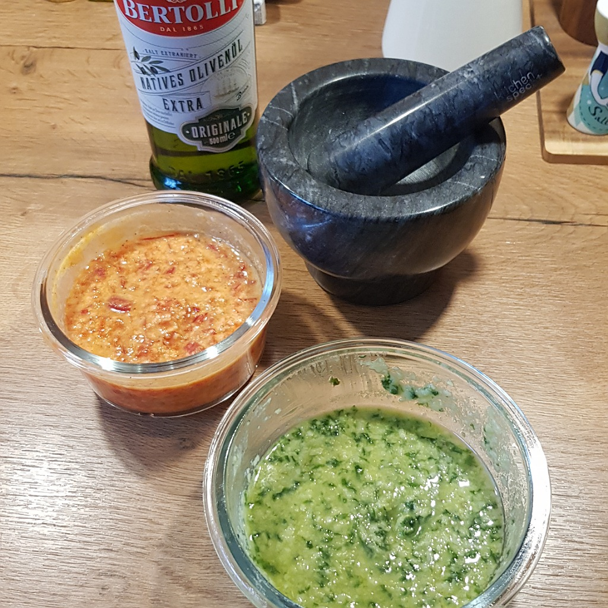

# Pesto

## Zutaten
- 20-30 Blätter Basilikum
- 1 Esslöffel Pinienkerne
- 1 Knoblauchzehe
- 20 g Parmesan
- Olivenöl

### Außerdem
- Salz
- Pfeffer

## Rezept
- Die Pinienkerne, die Knoblauchzehe mit 1 Esslöffel grobem Salz und Pfeffer in den Mörser geben

- Inhalt mörsern und 1 Esslöffel Olivenöl dazu schütten

- Nach und nach immer mehr Basilikum mörsern und je nach Konsistenz 1 Esslöffel Olivenöl nachkippen

- Nach dem Mörsern den Parmesan einrühren und wieder je nach Konsistenz Olivenöl dazurühren

## Tipp
- Pinienkerne durch andere Nüsse, wie Walnüsse, etc. ersetzen

- Statt Basilikum Paprika für Paprikapesto verwenden

- Wenn ein kleiner Mixer statt des Mörsers verwendet wird, entfaltet sich der Geschmack erst nach einiger Zeit, da die Basilikumöle beim mörsern schneller frei werden

*Guten Appetit*
