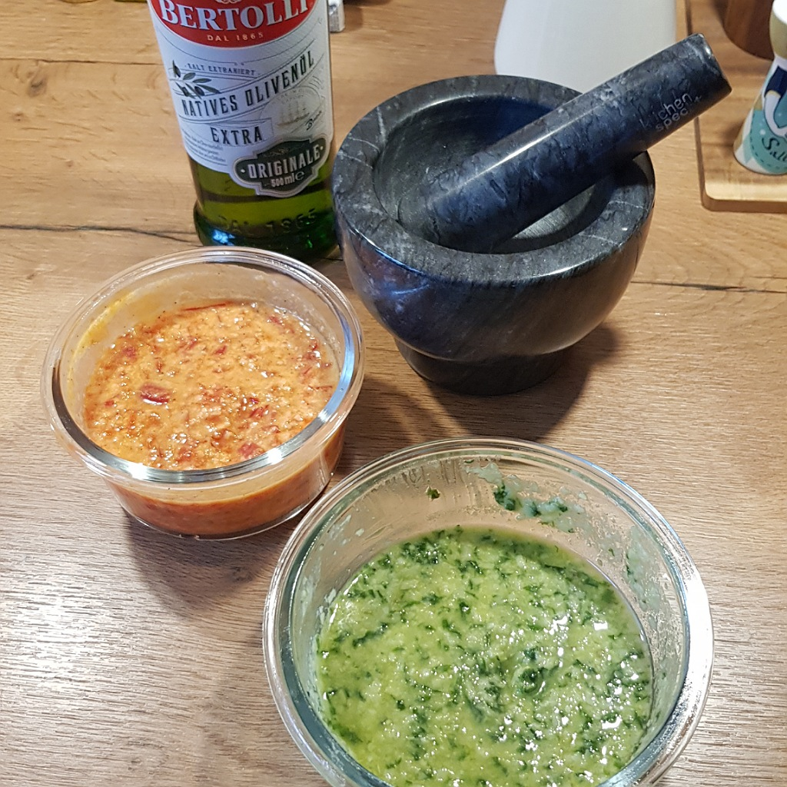

# Pesto

## Zutaten
- 20-30 Blätter Basilikum
- 1 Esslöffel Pinienkerne
- 1 kleine oder halbe Knoblauchzehe
- 20 g Parmesan
- Olivenöl

### Außerdem
- Salz
- Pfeffer

## Rezept
- Die Pinienkerne, die Knoblauchzehe mit 1 Esslöffel grobem Salz und Pfeffer in den Mörser geben

- Inhalt mörsern und 1 Esslöffel Olivenöl dazu schütten

- Nach und nach immer mehr Basilikum mörsern und je nach Konsistenz 1 Esslöffel Olivenöl nachkippen

- Nach dem Mörsern den Parmesan einrühren und wieder je nach Konsistenz Olivenöl dazurühren

## Tipp
- Pinienkerne durch andere Nüsse, wie Walnüsse, etc. ersetzen.

- Statt Basilikum Paprika für Paprikapesto verwenden.

- Alternativ zum Mörser kann auch ein Stabmixer verwendet werden. Funktioniert nur bei größeren Portionen. Kommt das Pesto direkt in die Pfanne mit Pasta kommt, wie [Tagliatelle al salmone e pesto](Tagliatelle_al_salmone_e_pesto.md), kann man auch etwas Nudelwasser ins Pesto mischen um das mixen zu vereinfachen.

*Guten Appetit*
