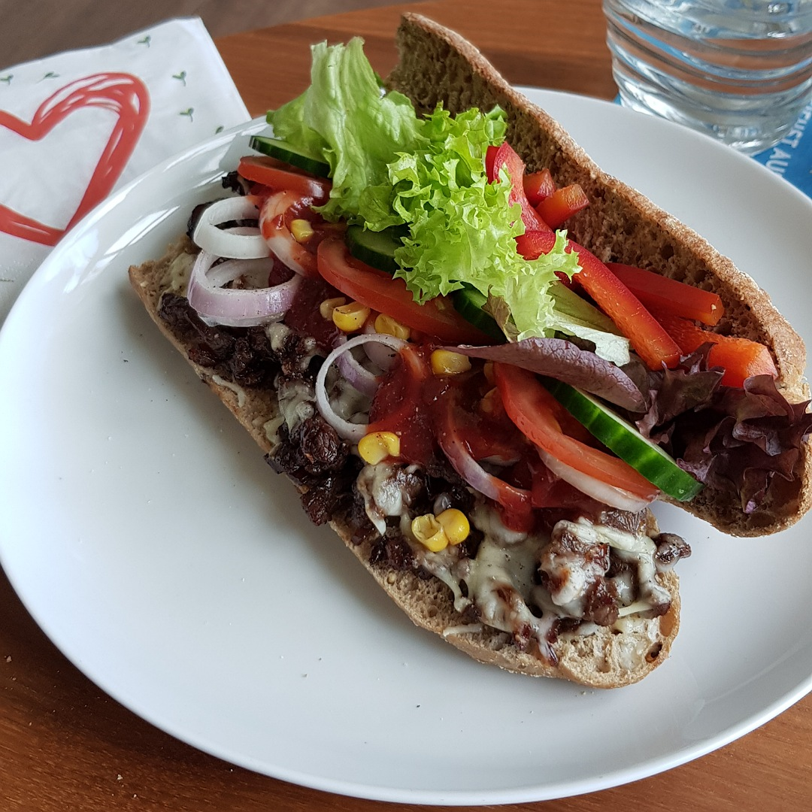

# Tomaten Sauce

Für eine Portion:

## Zutaten
- 100 g Rindersteak (z. B. Hüfte)
- 1/4 grüne Paprika
- 1 Schalotte oder 1/2 rote Zwiebel
- 30 g Reibkäse
- 20 cm Brot wie Baguette

## Rezept

*Guten Appetit*
