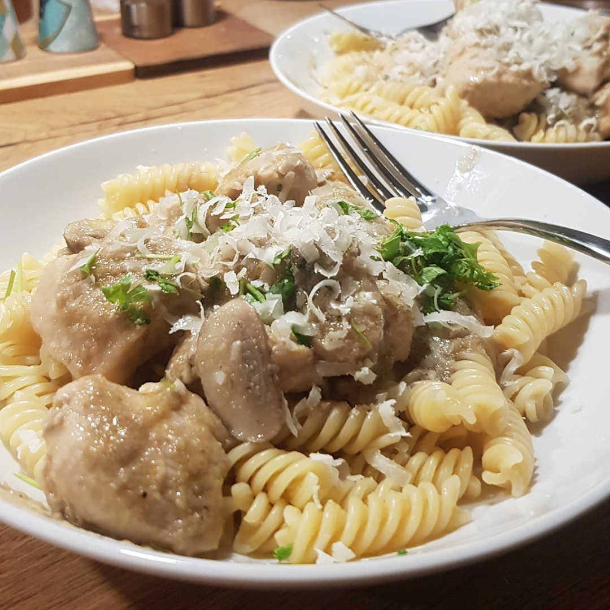

# Pilz Sauce

## Zutaten
- 250 g Pilze
- 1 Zwiebel
- 1 Knoblauchzehe
- 100 ml Weißwein
- 100-200 ml Gemüsebrühe
- 10 Stangen Petersilie

### Außerdem
- Olivenöl
- Salz
- Pfeffer
- Paprikapulver

## Rezept
- Pilze, Zwiebel und Knoblauch würfeln

- Zwiebel und Knoblauch in einem Topf mit Olivenöl glasig braten

- Pilze bei mittlerer Hitze mit rösten, bis die Pilze leicht braun werden

- Topfinhalt salzen um so den Pilzen das Wasser zu entziehen

- Wenn sich das Pilzwasser einwenig reduziert hat, Weißwein einschütten

- ca. 30 Minuten mit Deckel köcheln lassen

- Zu einer Sauce pürieren

- Je nach Konsistenz 100-200 ml Gemüsebrühe einrühren und weiter köcheln lassen

- Petersilie klein hacken und zur Sauce geben

- Mit Pfeffer und Paprikapulver abschmecken

## Tipp
Einige Pilze zum gernieren vor dem köcheln heraus fischen

*Guten Appetit*
