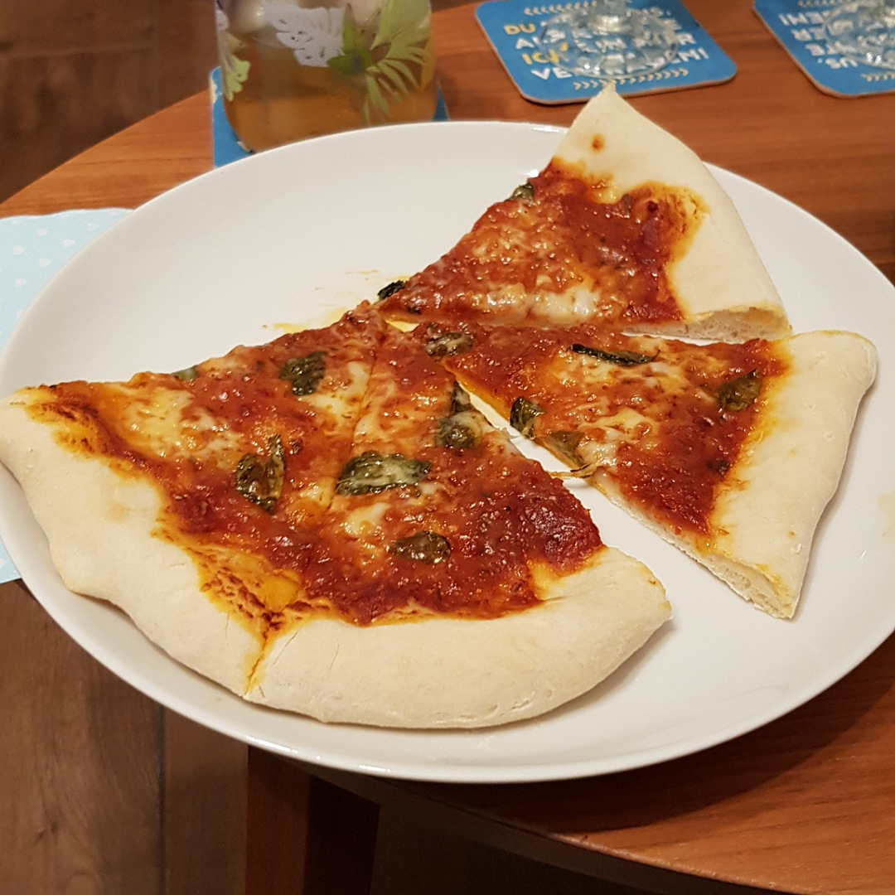

# Pizza Margherita

Für eine Pizza

## Zutaten
- [Pizzateig](Pizzateig.md)
- [Tomaten Sauce](Tomaten_Sauce.md)
- Büffelmozzarella
- Parmesankäse
- 6 Basilikumblätter

## Rezept
- Pizzateig von Hand zur Pizza formen

- Eine dünne Schicht Tomatensauce auftragen

- Mozzarella in groben Stückchen auflegen

- Basilikum blätter dazulegen

- Mit reichlich geriebenem Parmesan bestreuen

- Vorsichtig ein klein wenig Olivenöl übertreufeln lassen

- In dem vorgeheiztem Backofen ca. 8 Minuten bei 240°C Ober/Unterhitze backen.

*Guten Appetit*
