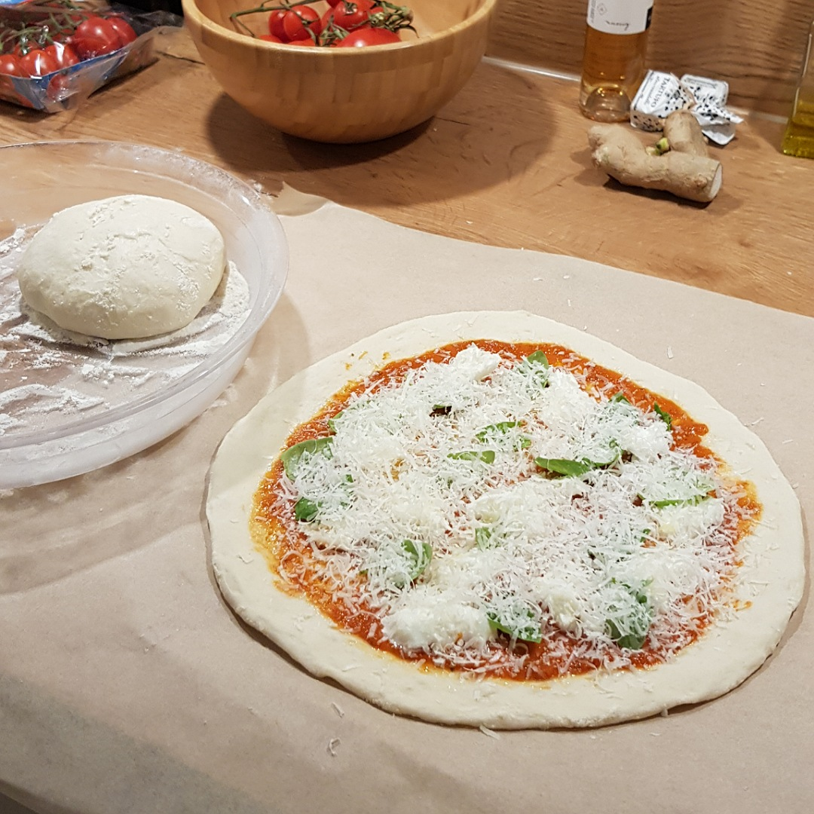
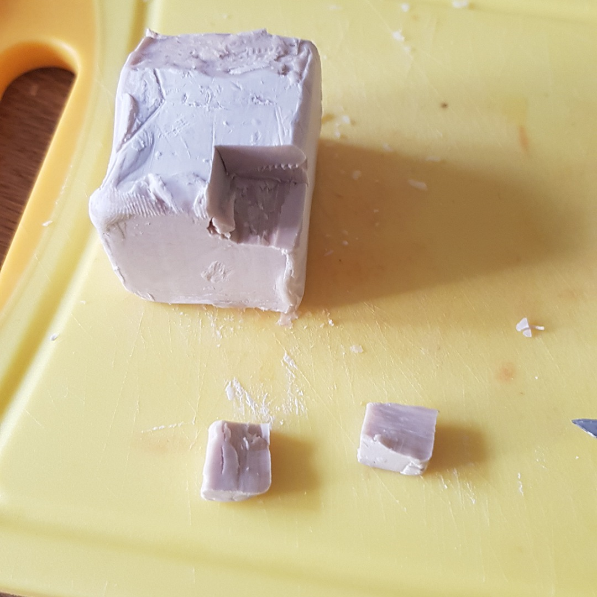

# Pizzateig

Für eine Pizza:

## Zutaten
- 150 g Mehl Typ 00
- 90 ml leicht kühles Wasser (60% zum Mehl)
- 1 Teelöffel / 5 g Salz
- ~1 g Hefe siehe Bild (42 g Hefewürfel):

## Rezept
- Wasser mit Salz und ca. 10% des Mehls vermischen

- Hefe hineinrühren

- Den Rest des Mehls hinzugeben und alles mit der Hand gut durchkneten

- Den Teig in eine eingeölte Schüssel legen und mit mit dem Öl einpinseln

- Mit einem feuchtem Trockentuch überdecken

- +4 Stunden ruhen lassen

- Den Teig nochmals mit der Hand durchkneten und je Pizza eine Kugel formen

- Die Kugeln in eine leicht eingemehlte Schüssel legen und mit ein bisschen Mehl bestreuen

- Wieder mit dem feuchtem Trockentuch bedecken

- weitere 2 Stunden ruhen lassen

- Vorsichtig eine Pizzakugel herausnehmen und auf eine mit Mehl bestreute Arbeitsfläche legen

- Je nach Teigfeuchte einmehlen, damit der Teig außen trocken wird

- Die Kugel in der Mitte eindrücken

- Die Pizza flach ziehen: durch eindrücken des Teigs nach außen hin und drehen der Pizza

## Hinweiß
Die Teigkugeln sollten am Ende nicht zu elastiasch, klebrig und keine trockene Kruste haben, bevor sie zur Pizza gezogen werden.
- zu klebrig:
  - zum Retten mit Mehl bestreuen 
  - weniger Wasser verwenden (50-55%, statt 60%)
- zu elastisch:
  - zum Retten mit einer Teigrolle flachrollen, wenn es von Hand nicht geht
  - weniger Wasser verwenden
  - Öl in der ersten Ruhephase vergessen?
- zu trocken:
  - zu viel Mehl vor der zweiten Ruhephase
  - Trockentücher nicht feucht genug?

## Tipp
Mit warmem Wasser, mehr Hefe und einem warmem Ruheort, 
benötigt der Teig nur rund 2x eine Stunde statt 4 + 2

*Guten Appetit*
