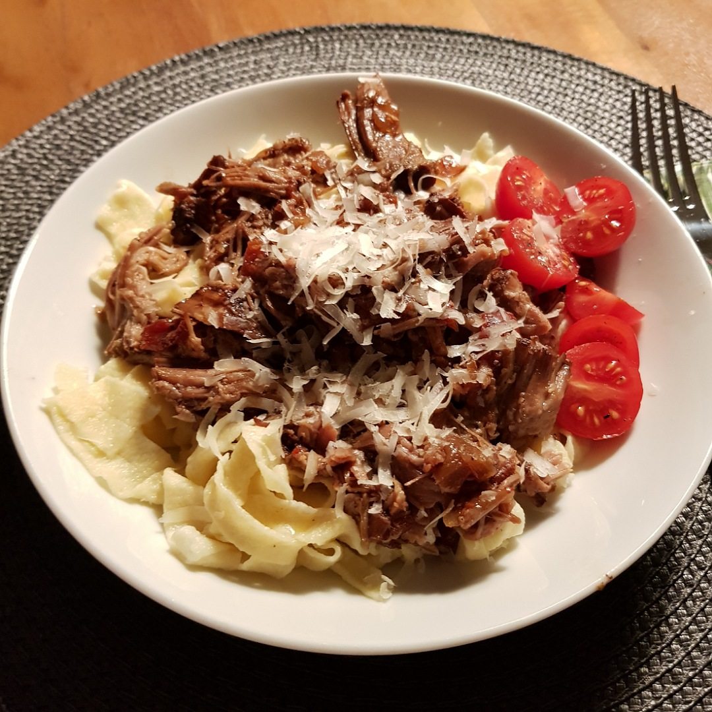

# Pulled Pork

Für 4 Portionen:

## Zutaten
- 1-2 kg Schweinenacken
- 1 große Zwiebel
- 3-4 Tomaten oder eine Dose gehackte Tomaten
- 2 Chilis (Optional)
- 250 ml Rotwein
- 50 ml Balsamicoessig
- 50 ml Olivenöl
- 4 Esslöffel Honig

### Außerdem
- Salz
- Pfeffer
- Paprikapulver

## Rezept
- Das Schweinefleisch in 4 Würfel schneiden (ca. 8x8 cm) und in einen Schmortopf (mit Deckel) legen

- Tomaten blanchieren (45 Sekunden kocken und häuten) und würfeln

- Zwiebeln würfeln

- Optional: Chilis in Scheiben schneiden

- Gemüse auf das Schweinefleisch verteilen

- Mit Reichlich Salz, Pfeffer und Paprikapulver würzen

- Honig, Balsamicoessig, Olivenöl und Rotwein übergießen

- Optional: Zum durchziehen lange kalt stellen, z. B. über Nacht

- Im Backofen insgesamt +3,5 h bei +180°C mit Topfdeckel backen
  - nach 2,5 h das Fleisch wenden
  - Rotwein nachgießen, wenn die Flüssigkeit zu viel verdunstet

- Mit zwei Gabeln zupfen

## Tipp
- Die Zutaten für die Marinade können auch je nach Geschmack variiert werden. Hauptsache, das Schweinefleisch wird nicht trocken.

*Guten Appetit*
