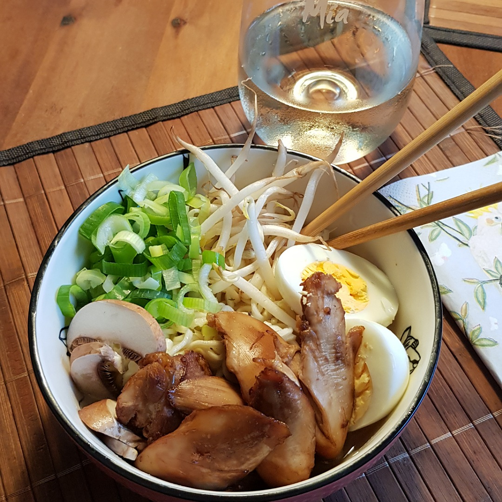

# Ramen

Für 4 Portionen:

## Zutaten
- 4 Hähnchenkeulen
- Mie-Nudeln ohne Ei
- 2 Eier
- 2 Pilze
- 3 Frühlingszwiebeln
- Sojasprossen
- Ingwer
- Knoblauch
- Suppengrün

## Rezept
- Suppe mit Suppengrün, Knoblauch und reichlich Ingwer ansetzen

- Hähnenkeulen 15 Minuten mit der Suppe mitkochen

- 1-2 Knoblauchzehen (je nach Größe) und ein gleicher Teil Ingwer klein hacken

- In einer kleinen Pfanne das Knoblauch und den Ingwer zusammen mit Sojasauce, Austernsauce und Wein aufkochen lassen
  - Die Marinade / Suppenwürze mit den Saucen abschmecken

- Die gekochten Hähnchenkeulen abkühlen lassen und das Fleisch herauszupfen
  - Die Reste (Haut, Knochen, Fett, ...) wieder zur Suppe geben

- Das Hähnchen mit der Marinade marinieren und mindestens 30 Minuten ziehen lassen

- Gleichzeitig:
  - Das Hähnchen für 8 Minuten bei 180° Ober/Unterhitze auf einem Backblech backen
  - Die Mie-Nudeln kochen / ins warme Wasser legen (je nach Packungszubereitung)
  - Die Eier hart kochen, pellen und halbieren
  - Die Frühlingszwiebeln und Pilze in Scheiben schneiden

- Das Suppengrün, etc. aus der Suppe fischen / abgießen und die Suppe / Brühe abschmecken

- Zubereiten:
  - 1-2 Esslöffel Marinade
  - Nudeln
  - Mit der Brühe aufgießen
  - Mit Hähnchen, einem halben Ei, Pilzen, Frühlingszwiebeln und Sojasprossen servieren

*Guten Appetit*
