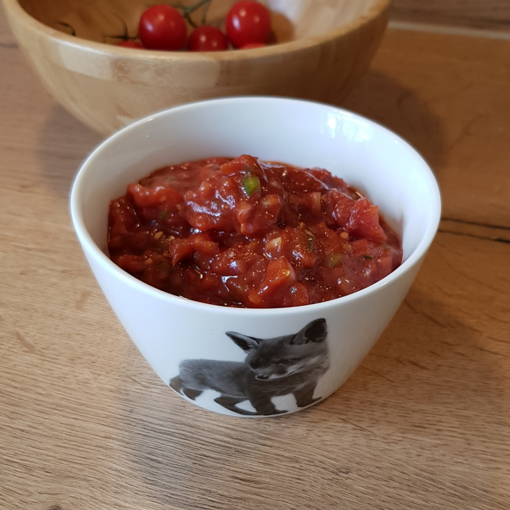

## Salsa

Für eine Schüssel:

## Zutaten
- 4 Tomaten
- 1 Zwiebel
- 1/2 oder kleine Knoblauchzehe
- 1/4 grüne Paprika
- 4 cm Chili (Optional)

### Außerdem
- Olivenöl
- Balsamico Essig
- Salz
- Pfeffer
- Honig
- Tomatenmark

## Rezept
- Tomaten 15 Minuten in einem Topf mit 1 L Wasser kochen 

- Abgießen und abkühlen lassen

- Tomaten häuten und Tomatenstiele herausschneiden

- Tomaten würfeln und abtropfen lassen

- Zwiebel, Knoblauchzehe, Paprika und Chili (optional) fein würfeln

- Alles in eine Schüssel geben und folgendes hinzufügen:
  + 2 Esslöffel Olivenöl
  + 1 Esslöffel Balsamico Essig
  + Salz und Pfeffer
  + Teelöffel Honig

- Solange wiederholt einen Esslöffel Tomatenmark unterrühren, bis die gewünschte Konsistenz erreicht ist (ca. 3x).

*Guten Appetit*
