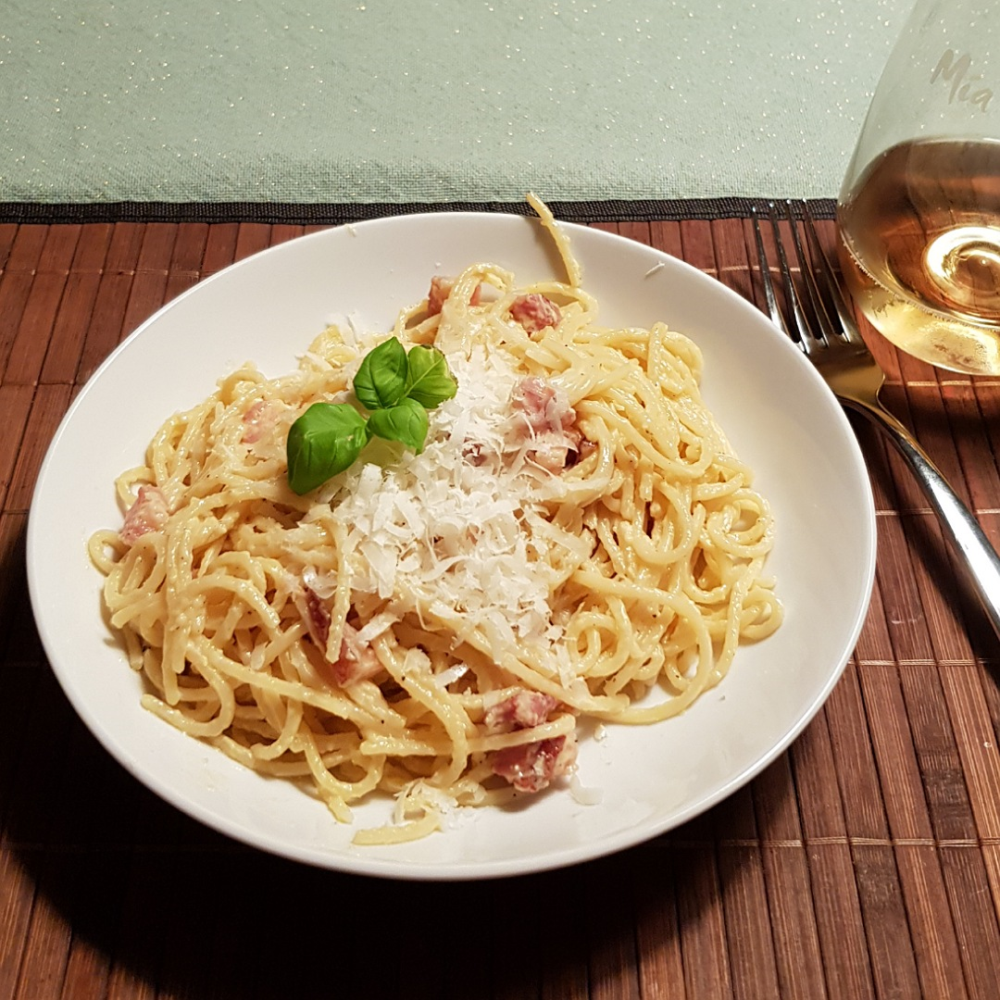

# Spaghetti Carbonara

Für eine Portion:

## Zutaten
- 100 g Spaghetti
- 60 g Pancetta oder Guanciale
- 30 g Parmesan
- 2 Eigelb

### Außerdem
- Olivenöl
- Salz
- Pfeffer

## Rezept
- Die 2 Eigelb mit dem Parmesan und Pfeffer in einer Schüssel vermengen

- Spaghetti kochen (nicht abgießen wenn sie fertig sind!)

- Gleichzeitig zu den Spaghettis, in einer großen Pfanne ohne Öl den Pancetta braten
  - Wenn die Pancetta nicht genug fett hat, ein bisschen Olivenöl verwenden

- In der Zwischenzeit 1-2 Esslöffel des Nudelsalzwassers in die Schüssel geben und dann die Eigelbkäsemasse durchrühren

- Wenn die Spaghettis fertig sind, direkt aus dem Topf in die Pfanne geben

- Mehrere Löffel des Nudelsalzwassers ebenfalls in die Pfanne geben

- Eigelbkäsemasse in die Pfanne geben und alles durchrühren

- Nochmals etwas Nudelsalzwasser einrühren, falls es zu trocken ist (trocknet auf dem Teller weiter, schneller als man denkt...)

*Guten Appetit*
