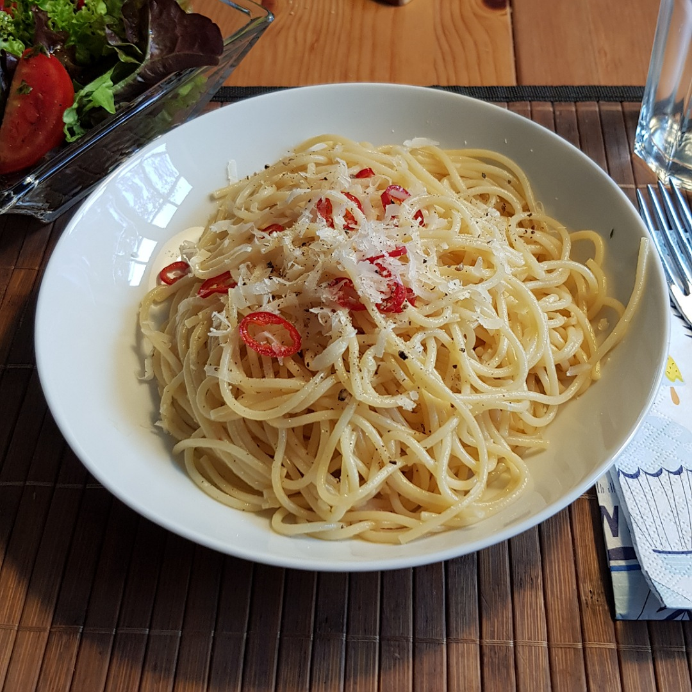

# Speghetti aglio e olio

Für eine Portion:

## Zutaten
- 125 g Spaghetti
- 1 Knoblauchzehe

## Rezept
- Spaghetti kochen

- Knonlauch fein würfeln

- Während der letzten 3-4 Minuten kochzeit reichlich Olivenöl (2-3 Esslöffel) in einer großen Pfanne erhitzen

- Knoblauch in die Pfanne geben und glasig braten

- Die fertigen Spaghetti direkt aus dem Topf in die Pfanne geben, zusammen mit etwas Nudelwasser

- Alles durchrühren und mit Pfeffer und ein bisschen Salz abschmecken (Durch das Nudelwasser ist es schon ein wenig gesalzen)

## Tipp
Für Spaghetti aglio, olio e peperoncino Chili zusammen mit dem Knoblauch braten.
Oder Petersilie am Ende hinzugeben.

*Guten Appetit*
