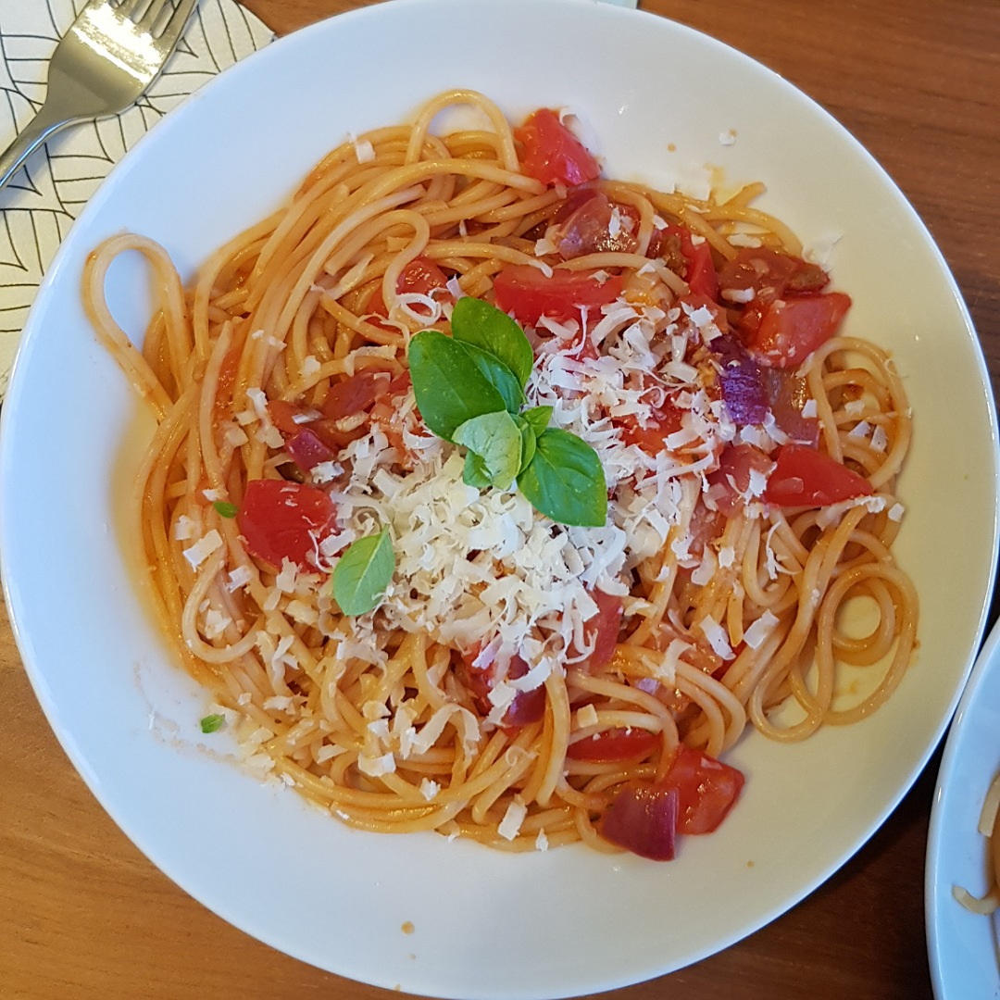

# Spaghetti del'orto

Für eine Portion:

## Zutaten
- 125 g Spaghetti
- 1 Tomate
- 1 Schalotte
- 15 cm Staudensellerie
- 5 Stängel Petersilie

### Außerdem
- Olivenöl
- Weißweinessig oder 1/4 Zitrone
- Salz
- Pfeffer

## Rezept
- Spaghetti 80% der Kochzeit kochen

- Schalotte und Sellerie klein würfeln

- In einer Pfanne mit 2 Esslöffel Olivenöl den Sellerie anbraten

- Schalotte dazugeben so lange braten, bis sie glasig werden

- Tomate würfeln

- Mit 2 Esslöffel Weißweinessig oder dem Saft der 1/4 Zitrone den Pfanneninhalt ablöschen

- Tomatenwürfel in die Pfanne geben

- Pfanneninhalt salzen und pfeffern

- Fertige Spaghetti direkt aus dem Topf in die Pfanne geben und das Nudelsalzwasser aufbewahren

- 1-2 Minuten in der Pfanne unterrühren
  - Wenn die Spaghetti zu trocken werden, ein wenig Nudelsalzwasser nach kippen
  - Oder je nach belieben noch einen weiteren Esslöffel Olivenöl

- Petersilie klein hacken

- Die Tomaten, die Petersilie und ein wenig Olivenöl in die Pfanne geben und eine Minute einrühren

- Mit Salz und Pfeffer abschmecken

*Guten Appetit*
