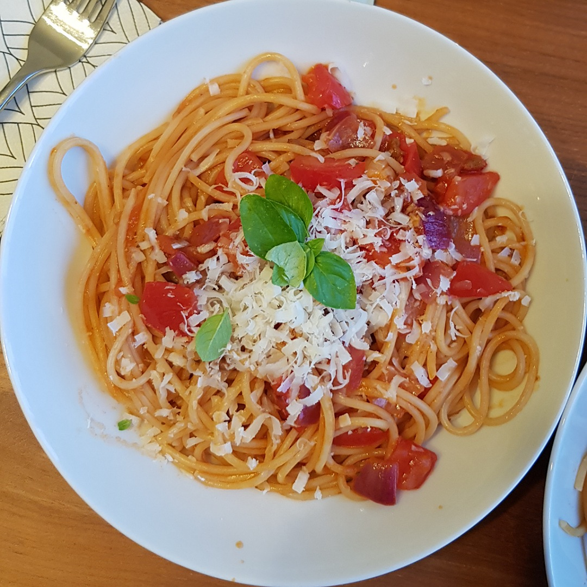

# Spaghetti del'orto

Für eine Portion:

## Zutaten
- 100 g Spaghetti
- 2 Tomaten
- 1 kleine Zwiebel
- 1 Knoblauchzehe
- 5 cm Staudensellerie
- 5 Stängel Petersilie

## Rezept
- Tomaten vierteln, entkernen und würfeln

- Die Tomatenkerne klein "würfeln"

- Spaghetti 80% der Kochzeit kochen

- Zwiebel und Sellerie würfeln

- Knoblauch andrücken

- In einer Pfanne mit 2 Esslöffel Olivenöl den Knoblauch dünsten

- Zwiebeln und Sellerie zur Pfanne geben und so lange braten, bis sie glasig werden

- Tomatenkerne zur Pfanne geben

- 2 Esslöffel Weißweinessig in die Pfanne geben

- Knoblauch aus der Pfanne fischen

- Fertige Spaghetti direkt aus dem Topf in die Pfanne geben und das Nudelsalzwasser aufbewahren

- Wenn die Spaghetti zu trocken werden, ein wenig Nudelsalzwasser nach kippen

- Die Tomaten und ein wenig Olivenöl in die Pfanne geben und 1-2 Minuten einrühren

- Mit Salz und Pfeffer abschmecken

*Guten Appetit*
