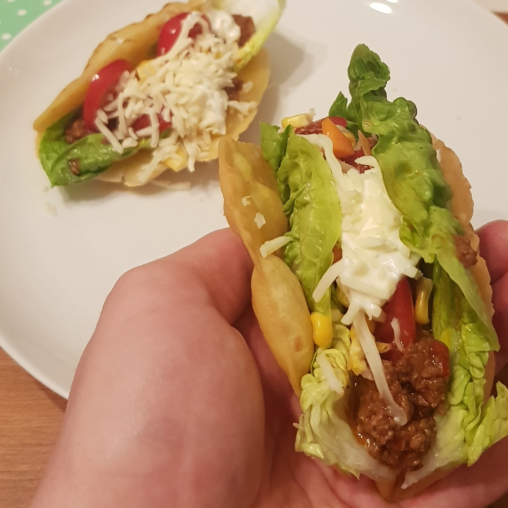

# Taco de cáscara dura

Für 4 hart Tacos:

## Zutaten
- 4 [Tortillas](Tortillas.md) oder 4 harte "TacoShells"
- 100 g Rinderhack
- 2 Schalotten
- 1 kleine Knoblauchzehe
- 50 g Eisbergsalat
- 50 g Mais
- 4 Kirschtomaten
- 30 g Reibkäse
- 20 g Cremé Fraich

### Außerdem
- Lebensmittelöl wie Sonnenblumenöl
- Tomatenmark
- Salz
- Pfeffer
- Paprikapulver

## Rezept
- Eine der Schalotten und Knoblauchzehe fein würfeln und mit dem Rinderhack vermengen

- 1 Esslöffel Tomatenmark in die Hackmischung rühren und würzen (Salz, Pfeffer, Chili, Paprika, ...)

- Mit Rapsöl in einer heißen Pfanne ca. 5 Minuten braten

- Tortillas:
  - ca. 100 ml Öl in einer kleinen Pfanne erhitzen (knapp 1 cm Höhe)

  - Tortillas mit einer Zange in U-Form frittieren und halten

- TacoShells:
  - Nach Beschriftung im Backofen backen

- Andere Schalotte in Scheiben schneiden und Kirschtomaten halbieren

- Belegen:
  - Salatblatt
  - Rinderhack
  - Zwiebelringe
  - Mais
  - Cremé Fraich
  - Reibkäse

*Guten Appetit*
