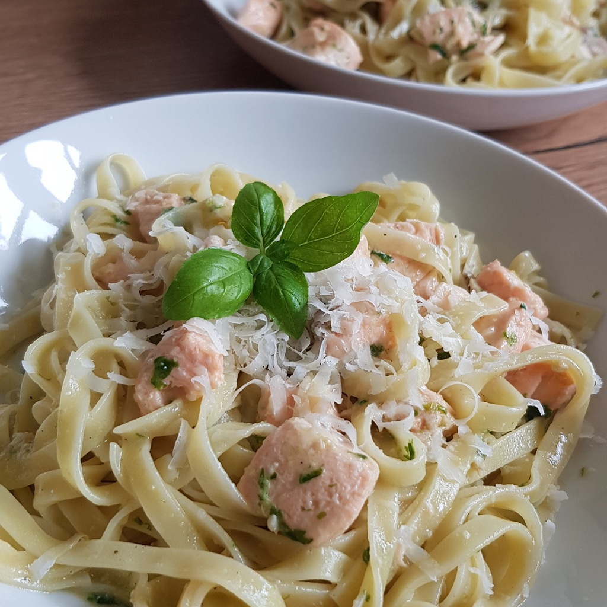

# Tagliatelle al salmone e pesto

Für eine Portion:

## Zutaten
- 100 g Tagliatelle
- 125 g Lachsfilet
- 2 Esslöffel [Pesto](Pesto.md)

### Außerdem
- Olivenöl
- Salz
- Weißweinessig

## Rezept
- Lachsfilet waschen und würfeln

- Tagliatelle in gesalztem Wasser ca. 80% der Kochzeit kochen

- Lachsfilet mit einem Esslöffel Olivenöl in einer großen Pfanne braten

- Bevor die Tagliatelle fertig sind, den Lachs mit etwas Weißweinessig ablöschen

- Pesto mit etwas Nudelwasser einrühren

- Wenn die Tagliatelle fertig sind, direkt aus dem Topf in die Pfanne geben und das Nudelwasser aufbewahren

- Je nach Konsistenz mehr Nudelwasser zur Pfanne geben und noch 1-2 Minuten weiter rührend braten lassen

*Guten Appetit*
