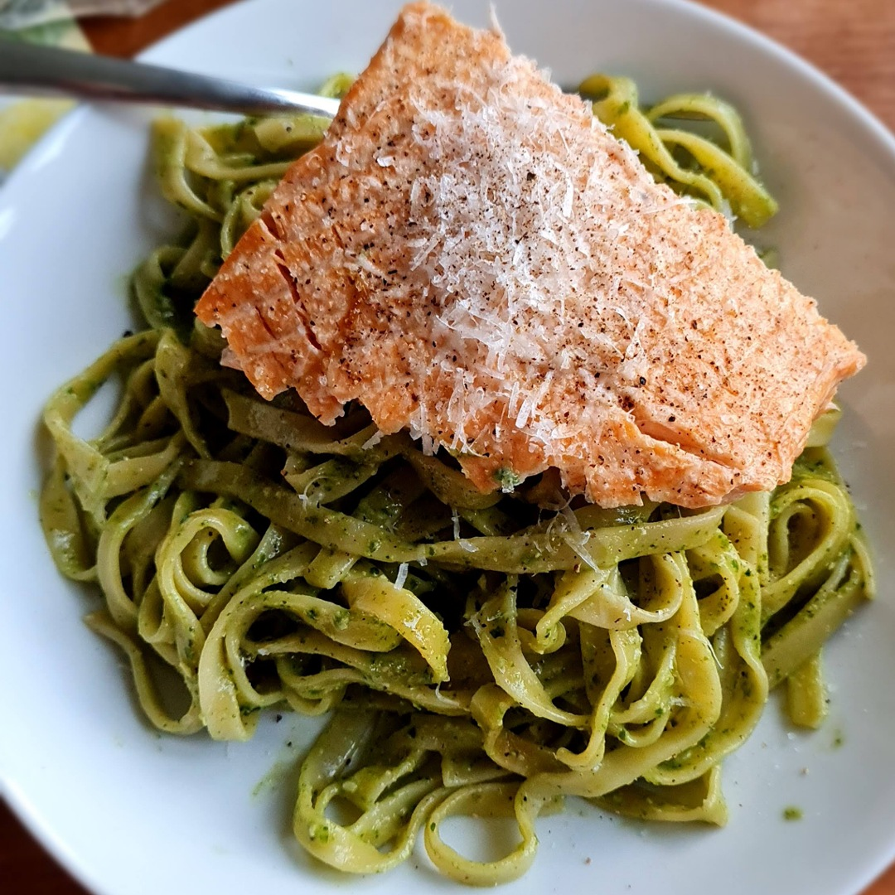

# Tagliatelle al salmone e pesto

Für eine Portion:

## Zutaten
- 100 g Tagliatelle
- 200 g Lachsfilet mit Haut
- 2 Esslöffel [Pesto](Pesto.md)

### Außerdem
- Olivenöl
- Salz
- Weißweinessig oder Zitronensaft

## Rezept
- Lachsfilet waschen und auf der Haut in einer großen Pfanne braten. Am besten mit Topfdeckel. Nach dem anbraten auf mittlere Hitze stellen und für insgesamt ca. 35 Minuten braten.

- Passend zum Ende der Bratzeit Tagliatelle in gesalztem Wasser ca. 80% der Kochzeit kochen

- Wenn die Tagliatelle fertig sind, den Lachs aus der Pfanne holen und die Tagliatelle direkt aus dem Topf in die Pfanne geben (Nudelwasser aufbewahren)

- Kurz 1-2 Minuten im Lachsöl braten und wenden und dann die Hitze abstellen

- Das Pesto mit etwas Nudelwasser in die Nudelpfanne einrühren.

- Je nach Konsitenz noch etwas Nudelwasser nachgeben

- Die Nudeln auf einem Teller servieren und darauf das Stück Lachs (ohne Haut) auflegen.

- Den Lachs auf den Nudeln salzen, pfeffern und ca. 1 Esslöffel Zitronensaft oder Weißweinessig überfließen lassen 

*Guten Appetit*
