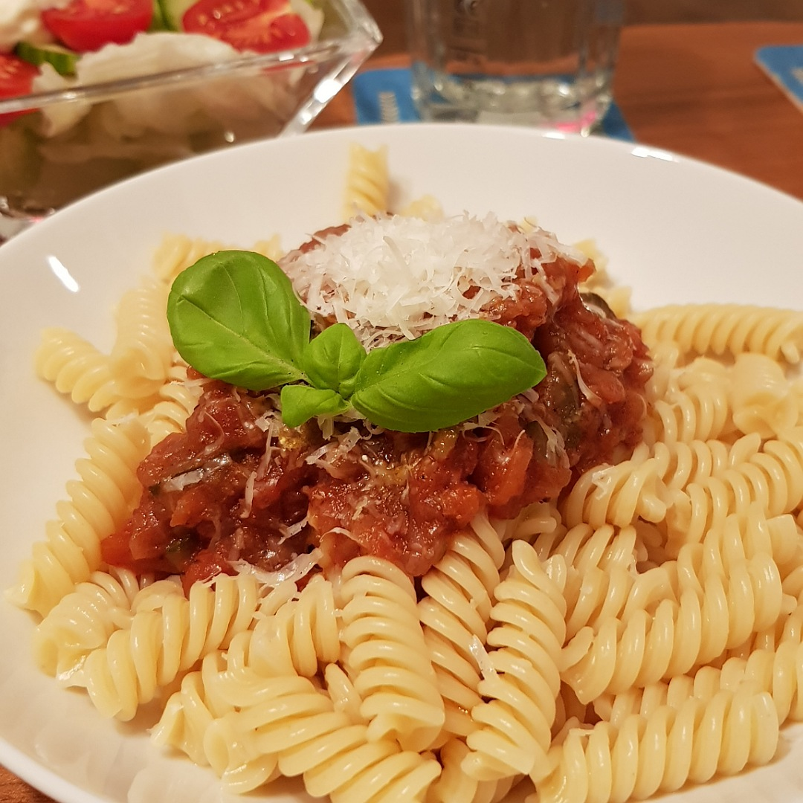

# Tomaten Gemüse Sauce

Für zwei Portionen

## Zutaten
- 4 Tomaten
- Zwiebelmix (3 Stück) (z. b. Rote, Gemüse und Schalotte)
- Knoblauchzehe 
- 1 Möhre
- 1/4 Zucchini
- 1 Stange Staudensellerie
- Ein paar Lorbeerblätter 
- 100 ml Rotwein

### Außerdem
- Olivenöl
- Rotweinessig
- Honig
- Zitronensaft
- Salz
- Pfeffer
- Oregano
- Chili (Pulver)
- Kreuzkümmel

# Rezept
- Tomaten blanchieren und häuten

- Tomaten würfeln

- Zwiebeln klein würfeln

- Möhre in Scheiben, oder Halbscheiben schneiden

- Zucchini und Sellerie würfeln

- Knoblauchzehe eindrücken

- 3 Esslöffel Olivenöl in einem Topf erhitzen und die Möhre kurz dünsten

- Zwiebel und Knoblauch hinzugeben, rühren und weiter braten

- Zucchini und Sellerie hinzugeben

- 2 Teelöffel Salz auf die Zucchini und Sellerie streuen

- Warten bis die Zwiebeln glasig werden

- Mit Rotwein ablöschen und die Tomaten hineinrühren

- Folgendes hinzugeben:
  - 2 Esslöffel Rotweinessig 
  - 1 Esslöffel Honig
  - Lorbeerblätter 
  - Einen Schuss Zitronensaft 

- Auf mittlere Hitze stellen und mit Topfdeckel rund 1-2 Stunden köcheln lassen, gelegentlich rühren

- Knoblauch und Lorbeerblätter herausfischen

- Würzen und abschmecken mit
  - Oregano
  - Pfeffer
  - 1/4 - 1/2 Teelöffel Chili
  - 1/2 Teelöffel Kreuzkümmel
  - 1 Esslöffel Olivenöl
  

*Guten Appetit*
