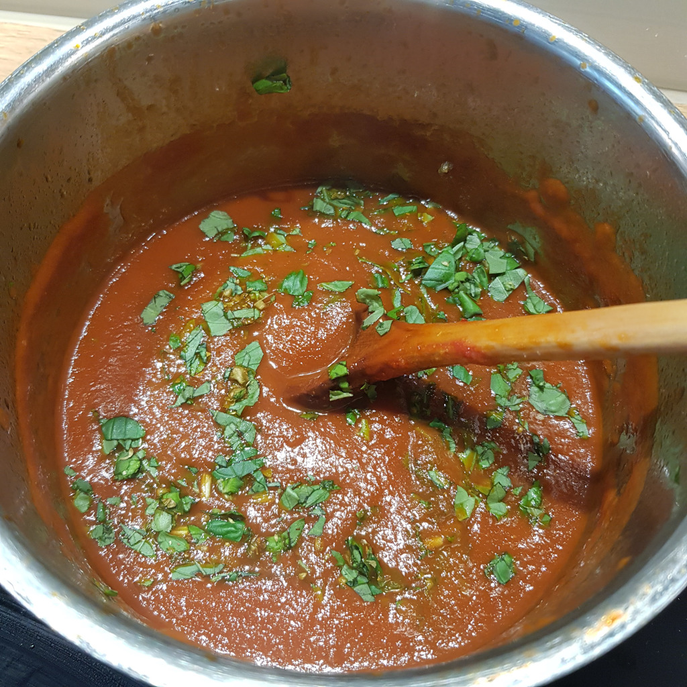

# Tomaten Sauce

Für ca. 2 Portionen:

## Zutaten
- 4 Tomaten
- 1 Knoblauchzehe
- 1 Zwiebel
- 6 Basilikumblätter (geht auch TK)
- 100 ml Rotwein
- 25 ml Balsamico Essig

## Rezept
- Tomaten blanchieren und häuten: 
Tomaten in 1 L kochendes Wasser geben, 45 Sekunden warten und ausgießen, dann mit kalten Wasser abkühlen und häuten

- Tomaten, Knoblauch und Zwiebeln in Stücke schneiden

- (kleiner) Topf auf hohe Hitze stellen und 3 Esslöffel Olivenöl hinein geben

- Knoblauch und Zwiebeln hinzugeben und unter rühren glasig dünsten (nicht anbrennen lassen) (ca. 1 Minute)

- Rotwein hinzugeben zum ablöschen (Vorsicht...)

- Tomaten hinzugeben, rühren und 2 Minuten auf hoher Hitze lassen

- Auf mittlere Hitze stellen und folgendes hinzugeben:
  + Balsamico Essig
  + Prise Zucker
  + Teelöffel Salz

- Mit Topfdeckel mindestens 20 Minuten köcheln lassen, gelegentlich umrühren

- Basilikum klein schneiden

- Mit dem Handmixer die Sauce pürieren

- Basilikum und ein bisschen Oregano hinzugeben

- Ohne Deckel weiter reduzieren lassen, bis die gewünschte Konsistenz erreicht ist (~ 20 Minuten)

- (Wenn du keine Tomatenkerne magst, kannst du die Sauce jetzt auch passieren)

## Tipp
Man kann auch gestückelte Tomaten aus der Dose verwenden, damit reduziert sich auch die Kochzeit

*Guten Appetit*
