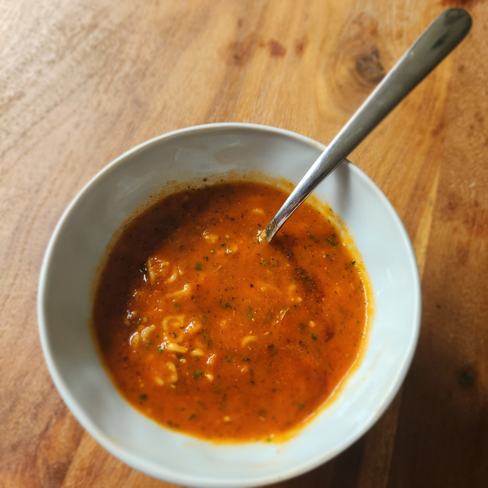

# Tomaten Suppe

Für vier Portionen

## Zutaten
- Sechs Tomaten oder eine Dose Tomaten
- 1 Zwiebel
- 1 Knoblauchzehe
- 1 Stange Staudensellerie
- ca. 100 ml Weißwein
- ca. 100 ml Brühe
- Optional: Suppennuddeln

## Außerdem
- Kräuter der Provinz
- Butter
- Olivenöl
- Tomatenmark
- Balsamico-Essig

## Rezept
- Tomatem anscheiden, blanchieren (kurz eine Minute in kochendes Wasser legen) abkühlen und häuten.

- Zwiebel, Knoblauch und Staudensellerie grob würfeln

- Etwas Butter mit der gleichen Menge Olivenöl in einem Topf zergehen lassen

- Das gewürfelte scharf anbraten, bis die Zwiebeln glasig werden

- In der Zwischenzeif die Tomaten grob würfeln

- Mit dem Weißwein ablöschen

- Tomaten und Brühe dazugeben

- 10-30 Minuten kochen lassen

- Mit dem Stabmixer pürieren

- Optional die Suppennudeln mit kochen lassen

- Je nach Konsistenz mit etwas Tomatenmark andicken

- Kräuter der Provienz einrühren

- Auf dem Teller mit einem Schuss Balsamicoessig, Salz und Pfeffer servieren

*Guten Appetit*
