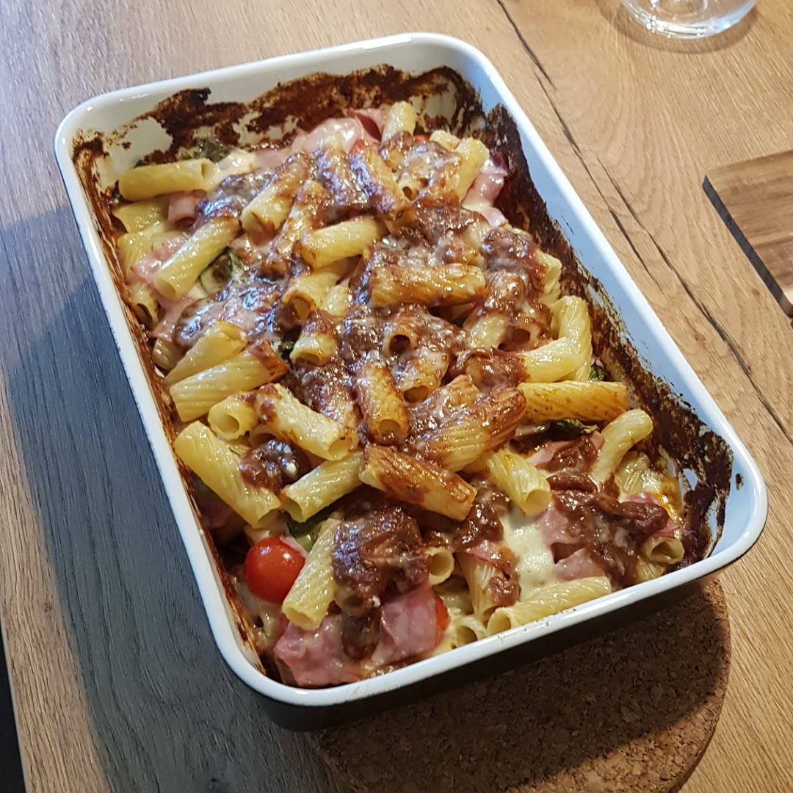

# Tortiglioni al forno

Für zwei Portionen:

## Zutaten
- [Tomaten Sauce](Tomaten_Sauce.md) (wie im Rezept für 2 Portionen)
- 250 g Tortiglioni
- 70 g Mozerella
- 50 g Parmesan
- 50 g Kochschinken
- 8 Kirschtomaten
- 10 Blätter Basilikum

## Rezept
- Tortiglioni kochen (80% der angegebenen Kochzeit)

- Mozerella, Kochschinken und die Tomaten schneiden

- Einen Teil der Tomatensauce in eine Auflaufform verteilen

- 2/3 der Nudeln drauf legen

- Ein weiterer Teil der Tomatensauce drüber laufen lassen

- Mozerella, Kochschinken, Tomaten und Basilikum hinzufügen

- Restliche Nudeln drauf legen

- Tomatensauce drüber laufen lassen

- Parmesankäse hinzugeben

- Mit Alufolio bedecken

- 25 Minuten bei 180° backen (vorgeheizt)

- Aluminiumfolie entfernen und weitere 5 Minuten backen

*Guten Appetit*
