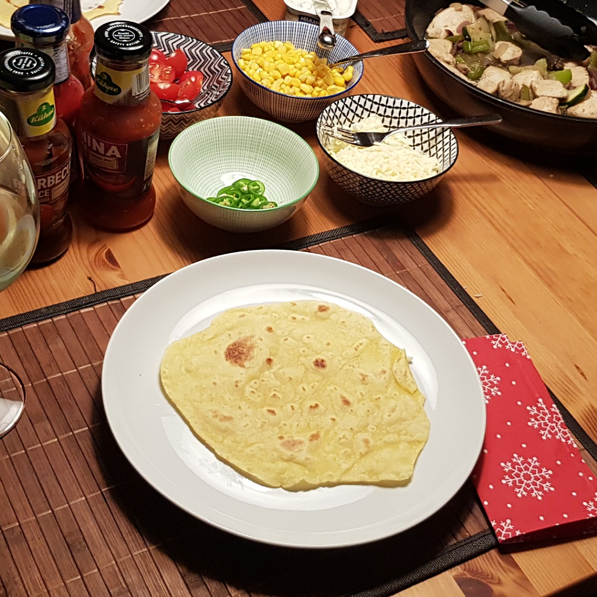

# Tortillas

Für 4 Tortillas:

## Zutaten
- 50 g Weizenmehl
- 50 g Maismehl
- 8 ml Olivenöl

### Außerdem
- Salz

## Rezept
- Mehl mit Olivenöl, Salz und 50 ml Warmwasser in einer Schüssel durchkneten

- Den Teig im Kühlschrank >15 Minuten ruhen lassen

- 4 Tischtennisball große Kugeln formen

- Mit Tortillapresse oder Nudelholz flach rollen

- In einer beschichteten Pfanne (ohne Öl) mit hoher Hitze vorsichtig von beiden Seiten je ca. 60 Sekunden backen (Durch bewegen kann anbrennen vermieden werden)

*Guten Appetit*
