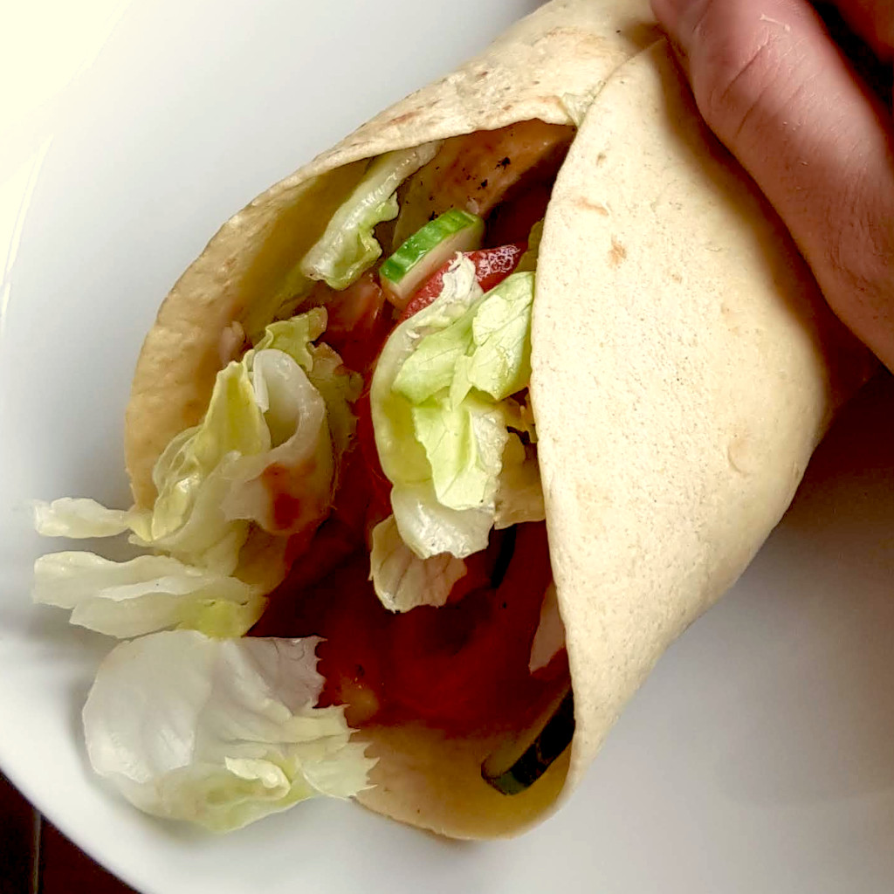

# Wraps

Für eine Portion

## Zutaten
- 1/2 [Hähnchenbrust](Haehnchenbrust.md)
- [Chili Sauce](Chili_Sauce.md)
- großer Wrap Tortilla
- ~1/4 Paprika
- ~1/2 Rote Zwiebel
- ~1/2 Tomate
- ~2 cm Salatgurke
- ~1/2 Pilz
- Romanasalat oder Eisbergsalat
- Käse

## Rezept
- [Hähnchenbrust](Haehnchenbrust.md) in 1 cm dicke Stücke schneiden

- Zwiebel in dünne Ringe schneiden

- Paprika in Streifen schneiden

- Pilz, Salatgurke und Tomaten in Scheibben schneiden

- Beim belegen sollte das untere drittel, das linke und das rechte drittel frei bleiben
  
- Noch warme [Hähnchenbrust](Haehnchenbrust.md):
  - Käse auf den Wrap verteilen und in der Mikrowelle ca. 50 Sekunden erwärmen
- Kühle [Hähnchenbrust](Haehnchenbrust.md):
  - [Hähnchenbrust](Haehnchenbrust.md) auf den Wrap verteilen
  - Käse auf die [Hähnchenbrust](Haehnchenbrust.md) streuen
  - In der Mikrowelle ca. 70 Sekunden erwärmen

- Wrap belegen:
  - Zwiebel und Pilze
  - [Chili Sauce](Chili_Sauce.md)
  - Paprika, Tomate und Salatgurke
  - Salatblätter
 
- Wrap falten:
  - Unteres drittel hoch falten
  - Danach von rechts und dann von links zu einer Tasche falten

*Guten Appetit*
